# 🏢 全國營業稅籍登記 ETL 系統

---

## 📋 目錄

- [專案概述](#-專案概述)
- [環境準備](#-環境準備)
- [快速開始](#-快速開始)
- [功能測試指南](#-功能測試指南)
- [題目一：數據資料收集](#-題目一數據資料收集)
- [題目二：數據應用服務](#-題目二數據應用服務)
- [題目三：Docker Log 蒐集 - IaC](#-題目三docker-log-蒐集---iac)
- [題目四：Docker Log 蒐集 - Log Implement](#-題目四docker-log-蒐集---log-implement)
- [資源清理](#-資源清理)

---

## 🎯 專案概述

### 專案簡介

本專案為數據工程面試作業，實作一個完整的 ETL（Extract-Transform-Load）系統，從台灣政府開放資料平台擷取全國營業稅籍登記資料（約 304MB、160 萬筆），經過資料清洗與驗證後，批次匯入 PostgreSQL 資料庫。

系統採用容器化架構，透過 Docker Compose 編排多個服務，並使用 Terraform 實現基礎設施即代碼（IaC），自動化部署 AWS CloudWatch 監控資源。日誌收集採用雙路徑設計，同時支援 Console 輸出與實體檔案兩種收集方式。

### 技術棧

| 類別 | 技術 | 版本 | 用途 |
|------|------|------|------|
| **Backend** | Django | 6.0.1 | Web 框架、ETL 管理命令 |
| **Database** | PostgreSQL | 15 | 關聯式資料庫 |
| **Task Queue** | Django-Q2 | 1.9.0 | 背景任務排程 |
| **Data Processing** | pandas | 3.0.0 | CSV 讀取與資料清洗 |
| **Container** | Docker | 24+ | 容器化部署 |
| **Orchestration** | Docker Compose | 2.0+ | 多容器編排 |
| **IaC** | Terraform | 1.7 | AWS 基礎設施管理 |
| **Cloud** | AWS CloudWatch | - | 日誌收集、監控、告警 |
| **Logging** | Watchtower | 3.4.0 | CloudWatch 日誌整合 |
| **Logging** | python-json-logger | 4.0.0 | 結構化 JSON 日誌 |

### 系統架構總覽

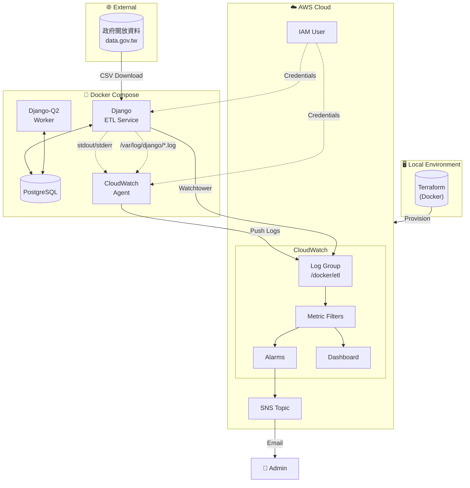

---

## 🔧 環境準備

### 系統需求

| 軟體 | 最低版本 | 必要性 | 說明 |
|------|----------|--------|------|
| Docker | 24.0+ | ✅ 必要 | 容器運行環境 |
| Docker Compose | 2.0+ | ✅ 必要 | 多容器編排 |
| AWS CLI | 2.0+ | ✅ 必要 | AWS 憑證設定 |
| Git | 2.0+ | ✅ 必要 | 版本控制 |

### macOS 安裝

```bash
# 安裝 Homebrew（如果尚未安裝）
/bin/bash -c "$(curl -fsSL https://raw.githubusercontent.com/Homebrew/install/HEAD/install.sh)"

# 安裝 Docker Desktop（包含 Docker Compose）
brew install --cask docker

# 安裝 AWS CLI
brew install awscli

# 安裝 Git
brew install git

# （可選）安裝 Poetry - 本地開發用
brew install poetry

# 驗證安裝
docker --version
docker compose version
aws --version
git --version
```

> ⚠️ **注意**：安裝完 Docker Desktop 後，請確保已啟動應用程式。

### Windows 安裝（使用 WSL）

本專案建議 Windows 使用者透過 WSL (Windows Subsystem for Linux) 運行，可獲得與 Linux 一致的開發體驗。

#### 步驟一：安裝 WSL
```powershell
# 以系統管理員身分開啟 PowerShell，執行：
wsl --install

# 安裝完成後重新啟動電腦
```

> 💡 預設會安裝 Ubuntu，重啟後會自動開啟設定使用者名稱和密碼。

#### 步驟二：安裝 Docker Desktop 並啟用 WSL 整合

1. 下載並安裝 [Docker Desktop](https://docs.docker.com/desktop/)
2. 安裝時勾選 **Use WSL 2 instead of Hyper-V**
3. 安裝完成後，重新啟動
4. 啟動 Docker Desktop，首次啟動需同意服務條款

#### 步驟三：在 WSL 中安裝相依套件
```bash
# 開啟 WSL 終端機（在開始選單搜尋 "Ubuntu" 或Command Prompt 執行 `wsl`）

# 更新套件列表
sudo apt update && sudo apt upgrade -y

# 安裝 Git
sudo apt install -y git

# 安裝 AWS CLI
sudo snap install aws-cli --classic


# 驗證安裝
docker --version          # 應顯示 Docker Desktop 版本
docker compose version
aws --version
git --version
```

> ⚠️ **注意**：
> 1. 所有後續操作請在 **WSL 終端機** 中執行，而非 PowerShell 或 CMD
> 2. 專案資料夾建議放在 WSL 檔案系統內（如 `~/projects/`），而非 Windows 路徑（如 `/mnt/c/`），以獲得更好的效能
> 3. 若 `docker` 命令無法執行，請確認 Docker Desktop 已啟動且 WSL Integration 已啟用
```


### Linux (Ubuntu/Debian) 安裝

```bash
# 更新套件列表
sudo apt update

# 安裝 Docker
sudo apt install -y docker.io docker-compose-v2

# 將當前使用者加入 docker 群組（免 sudo）
sudo usermod -aG docker $USER
newgrp docker

# 安裝 AWS CLI
curl "https://awscli.amazonaws.com/awscli-exe-linux-x86_64.zip" -o "awscliv2.zip"
unzip awscliv2.zip
sudo ./aws/install
rm -rf aws awscliv2.zip

# 安裝 Git
sudo apt install -y git


# 驗證安裝
docker --version
docker compose version
aws --version
git --version
```

### AWS IAM User 建立（Terraform 部署用）

Terraform 需要一個具有足夠權限的 IAM User 來建立 CloudWatch 相關資源。

#### 方法一：透過 AWS Console 建立

1. 登入 AWS Console
2. 前往 **IAM** → **Users** → **Create user**
3. 輸入使用者名稱：`terraform-deployer`
4. 選擇 **Attach policies directly**，附加以下政策：
   - `CloudWatchFullAccess`
   - `IAMFullAccess`
   - `AmazonSNSFullAccess`
5. 建立使用者後，前往點擊剛創立的使用者名稱 → **Create access key**
6. 選擇 **Command Line Interface (CLI)**
7. 記下 `Access Key ID` 和 `Secret Access Key`

#### 方法二：透過 AWS CLI 建立

```bash
# 建立 IAM User
aws iam create-user --user-name terraform-deployer

# 附加必要政策
aws iam attach-user-policy --user-name terraform-deployer \
    --policy-arn arn:aws:iam::aws:policy/CloudWatchFullAccess

aws iam attach-user-policy --user-name terraform-deployer \
    --policy-arn arn:aws:iam::aws:policy/IAMFullAccess

aws iam attach-user-policy --user-name terraform-deployer \
    --policy-arn arn:aws:iam::aws:policy/AmazonSNSFullAccess

# 建立 Access Key
aws iam create-access-key --user-name terraform-deployer
```

> 📝 **記下輸出的 `AccessKeyId` 和 `SecretAccessKey`，下一步會用到。**

---

## 🚀 快速開始

### Step 1：Clone 專案

```bash
git clone https://github.com/wrbyepct/assignment.git
cd assignment
```

### Step 2：設定 Terraform AWS 憑證

編輯 `terraform/.env.aws` 檔案，填入你的 AWS 憑證：

```bash
# 複製範本
cp terraform/.env.aws terraform/.env

# 編輯設定
vim terraform/.env.aws  # 或使用任何編輯器
```

填入以下內容：

```env
# AWS 憑證（用於 Terraform 部署）
AWS_ACCESS_KEY_ID=你的-access-key-id
AWS_SECRET_ACCESS_KEY=你的-secret-access-key
AWS_DEFAULT_REGION=ap-northeast-1

# 告警通知信箱
TF_VAR_alarm_email=你的信箱@example.com
```

> ⚠️ **重要**：
> - 此檔案已加入 `.gitignore`，不會被提交到版本控制
> - `TF_VAR_alarm_email` 必須填寫，否則不會收到告警通知

### Step 3：執行 One-Click Setup

```bash
# 賦予執行權限
chmod +x run

# 執行一鍵部署
./run setup
```

這個指令會自動執行以下步驟：

| 步驟 | 說明 | 預估時間 |
|------|------|----------|
| 1 | Terraform Init & Apply | ~5-10 分鐘 |
| 2 | 取得 IAM User Credentials | ~5 秒 |
| 3 | 寫入 `.env.local` | ~1 秒 |
| 4 | 寫入 CloudWatch Agent Credentials | ~1 秒 |
| 5 | Docker Compose Build & Up | ~2-3 分鐘 |

成功後會看到：

```
==============================================
  環境已成功設定！
==============================================

📍 服務位置：
   - Django Admin: http://localhost:8000/admin
   - CloudWatch Dashboard: 請至 AWS Console 查看

📋 後續指令：
   ./run dry-run        # 測試 ETL（不實際寫入）
   ./run etl            # 執行完整 ETL
   ./run resume         # 執行任務斷點續傳
```

### Step 4：確認 SNS Email 訂閱

執行 `setup` 後，AWS SNS 會發送一封確認信到你設定的信箱。

1. 檢查你的信箱（包括垃圾郵件資料夾）
2. 找到來自 `AWS Notifications` 的郵件
3. 點擊 **Confirm subscription** 連結

```
📧 信件主旨：AWS Notification - Subscription Confirmation
📧 寄件者：no-reply@sns.amazonaws.com
```

> ⚠️ **重要**：如果不確認訂閱，將無法收到 CloudWatch 告警通知！

### Step 5：驗證部署成功

```bash
# 檢查所有容器是否正常運行
docker compose ps
```

預期輸出：

```
NAME                IMAGE                              STATUS
etl-django          your-repo-django                   Up (healthy)
etl-postgres        postgres:15-bullseye               Up (healthy)
q-worker            your-repo-django                   Up
cloudwatch-agent    amazon/cloudwatch-agent:latest     Up
```

```bash
# 檢查 Django Admin 是否可訪問
curl -I http://localhost:8000/admin/
```

預期輸出：

```
HTTP/1.1 302 Found
```

🎉 **恭喜！環境部署完成，可以開始測試了。**

---

<!-- 以下區塊待後續批次補充 -->

## 🧪 功能測試指南

本章節提供完整的功能測試步驟，讓審閱人員可以驗證系統各項功能。

### 測試前準備

確保環境已正確部署：

```bash
# 確認所有容器正常運行
docker compose ps

# 確認 Django 服務健康
curl -I http://localhost:8000/admin/ | head -5
```

---

### ETL Dry Run 測試

Dry Run 模式會執行完整的資料擷取與驗證流程，但**不會實際寫入資料庫**，適合用於測試資料品質和 ETL 邏輯。

```bash
./run dry-run
```

**預期輸出：**

```
📥 階段 1: 擷取資料...
🔄 階段 2: 轉換並載入資料...

📦 批次 1
  原始筆數: 50,000
  清理: 50,000 → 49,876 筆
  🔍 DRY RUN: 將匯入 49,876 筆

📦 批次 2
  原始筆數: 50,000
  ...

============================================================
執行摘要
============================================================
執行 ID:      1
狀態:         成功
執行時間:     45.23 秒

處理統計:
  總筆數:     100,000
  ✅ 成功:    0 (0.00%)        # Dry Run 不實際寫入
  ❌ 失敗:    124
  🔄 重複:    0
```

**驗證重點：**
- ✅ 資料成功從政府開放資料平台下載
- ✅ 資料清理邏輯正確執行
- ✅ 顯示 `DRY RUN` 提示，未實際寫入
- ✅ 錯誤筆數統計正確

---

### ETL 完整匯入（Truncate）

執行完整的 ETL 流程，會**清空現有資料**後重新匯入全部資料。

```bash
./run etl
```

系統會提示確認：

```
⚠️  執行全量覆蓋: 即將刪除 0 筆營業登記資料!
確定要繼續嗎? (yes/no): yes
```

**預期輸出：**

```
🗑️  清空資料表...
  ✅ 完成

============================================================
開始執行 ETL (ID: 2)
============================================================

📥 階段 1: 擷取資料...
🔄 階段 2: 轉換並載入資料...

📦 批次 1
  原始筆數: 50,000
  清理: 50,000 → 49,876 筆
  ✅ 成功匯入: 49,876 筆

...（約 48 個批次）...

============================================================
執行摘要
============================================================
執行 ID:      2
狀態:         成功
執行時間:     312.45 秒

處理統計:
  總筆數:     2,400,000
  ✅ 成功:    2,398,234 (99.93%)
  ❌ 失敗:    1,766
  🔄 重複:    0
```

**驗證資料是否正確匯入：**

```bash
# 進入 Django Shell
./run django-shell

# 檢查資料筆數
>>> from core.tax_registration.models import TaxRegistration
>>> TaxRegistration.objects.count()
2398234

# 檢查範例資料
>>> TaxRegistration.objects.first()
<TaxRegistration: 12345678 - 某某股份有限公司>
```

---

### ETL 失敗場景測試

測試 ETL 失敗時的告警機制和錯誤記錄。

#### 方法：修改程式碼強制失敗

1. 編輯 `core/tax_registration/management/commands/load_tax_registration.py`：

```python
def handle_successful_etl_job(self):
    """執行 ETL Job, 更新成功結果, log 成功訊息"""
    # 加入這行來強制失敗
    raise Exception("測試失敗場景！")
    
    with self._track_progress():
        self._run_etl()
    self.tracker.complete()
```

2. 重新執行 ETL：

```bash

# 執行 ETL（會失敗）
./run etl --auto
```

**預期輸出：**

```
============================================================
開始執行 ETL (ID: 3)
============================================================

CommandError: 執行失敗: 測試失敗場景！
```

**驗證失敗記錄：**

```bash
./run django-shell

>>> from core.tax_registration.models import ETLJobRun
>>> job = ETLJobRun.objects.latest('started_at')
>>> job.status
'failed'
>>> job.error_message
'測試失敗場景！'
```

> ⚠️ **測試完成後，記得移除 `raise Exception` 這行！**

---

### ETL 斷點續傳（Resume）

測試 ETL 中斷後從上次成功的批次繼續執行。

#### 模擬中斷場景

1. 執行 ETL 並在過程中手動中斷（Ctrl+C）：

```bash
./run etl --auto

# 等待執行到第 10 批次左右，按 Ctrl+C 中斷
```

2. 檢查進度記錄：

```bash
./run django-shell

>>> from core.tax_registration.models import ImportProgress, ETLJobRun
>>> job = ETLJobRun.objects.latest('started_at')
>>> job.status
'running'  # 因為被中斷，狀態還是 running

>>> progress = ImportProgress.objects.get(job_run=job)
>>> progress.last_successful_batch
10  # 最後成功的批次
```

3. 執行斷點續傳：

```bash
# 等五分鐘後跑斷點續傳(測試用心跳時間)
./run resume
```

**預期輸出：**

```
  ⏩ 從批次 11 繼續...

============================================================
開始執行 ETL (ID: 4)
============================================================


📥 階段 1: 擷取資料...
🔄 階段 2: 轉換並載入資料...

📦 批次 11
  原始筆數: 50,000
  ...
```

---

### CloudWatch 告警測試

#### 1. 測試 ETL Job Failed 告警

當 ETL 任務失敗時，應該收到 Email 告警。

1. **觸發條件**：ETL 任務執行失敗

2. **執行失敗的 ETL**：
```bash
./run etl --auto
```

3. **檢查告警狀態**：
   - 前往 AWS CloudWatch Console
   - 進入 **Alarms** → 找到 `etl-log-demo-etl-failed`
   - 狀態應該從 `OK` 變成 `In alarm`

4. **檢查 Email**：
   - 收到主旨為 `ALARM: "etl-log-demo-etl-failed" in Asia Pacific (Tokyo)` 的郵件

#### 2. 測試 High Error Count 告警

當 5 分鐘內發生 5 個以上 ERROR 時觸發告警。

1. **手動產生 ERROR Log**：

```bash
./run django-shell

>>> import logging
>>> logger = logging.getLogger('tax_registration.etl')
>>> for i in range(6):
...     logger.error(f"測試錯誤 #{i+1}")
```

2. **等待 1-2 分鐘**（CloudWatch Metric Filter 需要時間處理）

3. **檢查告警狀態**：
   - 前往 CloudWatch Console → **Alarms**
   - 找到 `etl-log-demo-high-error-count`
   - 狀態應該變成 `In alarm`

4. **檢查 Email**：
   - 收到主旨為 `ALARM: "etl-log-demo-high-error-count"` 的郵件

> 💡 **提示**：告警只在狀態**變化**時發送通知（OK → ALARM），持續處於 ALARM 狀態不會重複發送。

---

### CloudWatch Dashboard 檢視

1. 前往 AWS CloudWatch Console

2. 點擊左側選單 **Dashboards**

3. 找到 `etl-log-demo-etl-dashboard`

4. Dashboard 包含以下 Widget：

| Widget | 說明 |
|--------|------|
| ❌ ERROR 數量 | 錯誤發生趨勢圖 |
| ✅ ETL 完成次數 | 成功/失敗次數對比 |
| 📊 處理筆數 | 每次 ETL 處理的記錄數 |
| 📋 最近的 Log 事件 | 即時 Log 查詢結果 |
| 🚨 告警狀態 | 所有告警的當前狀態 |

5. **驗證 Log 是否正確收集**：
   - 在「最近的 Log 事件」Widget 中應該看到 JSON 格式的 Log
   - 包含 `timestamp`、`level`、`message` 等欄位

---

### Django-Q2 排程設定

透過 Django Admin 介面設定定時執行 ETL 任務。

#### Step 1：登入 Django Admin

1. 開啟瀏覽器，前往 http://localhost:8000/admin/
2. 使用以下帳號登入：
   - Username: `admin`
   - Password: `admin`

#### Step 2：建立排程任務

1. 在 Admin 首頁，找到 **DJANGO Q2** 區塊
2. 點擊 **Scheduled tasks** → **Add**
3. 填寫以下設定：

| 欄位 | 值 | 說明 |
|------|-----|------|
| Name | `Daily ETL Import` | 任務名稱 |
| Func | `core.tax_registration.tasks.run_tax_import` | 要執行的函數 |
| Schedule Type | `Cron` | 使用 Cron 表達式 |
| Cron | `0 2 * * *` | 每天凌晨 2 點執行 |
| Repeats | `-1` | 無限重複 |

4. 點擊 **Save**

5. 或使用 `run` 腳本一建執行
```bash
./run etl-per-day
```

#### Step 3：快速測試排程（Dry Run 版本）

如果想快速測試排程功能，可以建立一個 Dry Run 版本：

1. 點擊 **Scheduled tasks** → **Add**
2. 填寫以下設定：

| 欄位 | 值 |
|------|-----|
| Name | `Test ETL Dry Run` |
| Func | `core.tax_registration.tasks.run_tax_import_dry_run` |
| Schedule Type | `Minutes` |
| Minutes | `1` |
| Repeats | `5` |

3. 點擊 **Save**

4. 或使用 `run` 腳本一建執行
```bash
./run dry-run-per-min
```

5. 等待 1 分鐘，檢查任務執行結果：
   - 前往 **Successful tasks** 查看成功的任務
   - 或前往 **Failed tasks** 查看失敗的任務

#### Step 4：前往 q-worker 容器查看任務 logs

#### Step 5：監控任務狀態

在 Django Admin 中可以查看：

| 頁面 | 說明 |
|------|------|
| **Queued tasks** | 等待執行的任務 |
| **Successful tasks** | 成功完成的任務 |
| **Failed tasks** | 執行失敗的任務 |
| **Scheduled tasks** | 已設定的排程 |

---

### 測試 Checklist

| # | 測試項目 | 指令/操作 | 預期結果 | 通過 |
|---|----------|----------|----------|------|
| 1 | Dry Run | `./run dry-run` | 顯示 DRY RUN，不寫入資料 | ⬜ |
| 2 | 完整匯入 | `./run etl` | 成功匯入約 160 萬筆 | ⬜ |
| 3 | 失敗場景 | 修改程式碼觸發 | 狀態為 failed，有錯誤訊息 | ⬜ |
| 4 | 斷點續傳 | `./run resume` | 從上次批次繼續 | ⬜ |
| 5 | ETL Failed 告警 | 觸發失敗 | 收到 Email 告警 | ⬜ |
| 6 | High Error 告警 | 產生 6 個 ERROR | 收到 Email 告警 | ⬜ |
| 7 | Dashboard | AWS Console | 看到 5 個 Widget | ⬜ |
| 8 | 排程設定 | Django Admin | 任務成功執行 | ⬜ |

## 📊 題目一：數據資料收集

### 1. 設計概念

本系統採用經典的 **ETL（Extract-Transform-Load）三階段架構**，處理來自政府開放資料平台的全國營業稅籍登記資料。資料規模約 304MB、包含超過 160 萬筆營業登記記錄，屬於中大型資料集，無法一次載入記憶體處理。

#### 核心設計原則

| 原則 | 說明 | 實踐方式 |
|------|------|----------|
| **記憶體效率** | 避免一次載入整個 CSV 導致記憶體溢出（OOM） | 使用 pandas `chunksize` 參數分批讀取，每批次 50,000 筆 |
| **失敗容錯** | 單一批次失敗不應導致整個 ETL 流程中斷 | 每批次獨立處理，錯誤記錄到資料庫，支援斷點續傳 |
| **資料完整性** | 確保每批次資料要嘛全部寫入，要嘛全部回滾 | 使用 PostgreSQL Transaction 包裹每批次的寫入操作 |
| **可追溯性** | 便於問題排查與執行歷史查詢 | 記錄每次 ETL 的執行狀態、處理筆數、錯誤明細於 `ETLJobRun` 表 |
| **冪等性** | 重複執行不會產生重複資料 | 使用 `--truncate` 清空後重建，或 `--resume` 從斷點續傳 |

#### 為何選擇 Django Management Command？

本專案的 ETL 入口點是 Django Management Command（`load_tax_registration`），而非獨立的 Python 腳本。這個選擇基於以下考量：

| 考量點 | Django Management Command | 獨立 Python Script |
|--------|---------------------------|-------------------|
| **ORM 整合** | ✅ 直接使用 Django Model，無需額外設定 | ❌ 需手動呼叫 `django.setup()` |
| **設定管理** | ✅ 自動載入 `settings.py` 中的資料庫、Log 設定 | ❌ 需額外處理環境變數與設定檔 |
| **資料庫連線** | ✅ 使用 Django 內建的連線池管理 | ❌ 需自行管理連線生命週期 |
| **與排程整合** | ✅ Django-Q2 可透過 `call_command()` 直接呼叫 | ⚠️ 需額外包裝成可呼叫的函數 |
| **參數解析** | ✅ 內建 `argparse` 整合，支援 `--help` | ❌ 需自行實作參數解析 |
| **測試支援** | ✅ 可在測試中用 `call_command()` 驗證 | ❌ 需模擬 CLI 環境或 subprocess |


#### 資料模型設計

本系統的資料模型分為兩大類：**業務資料模型**（ETL 的目標資料）與 **ETL 追蹤模型**（記錄執行狀態與錯誤）。

##### Model 關係總覽

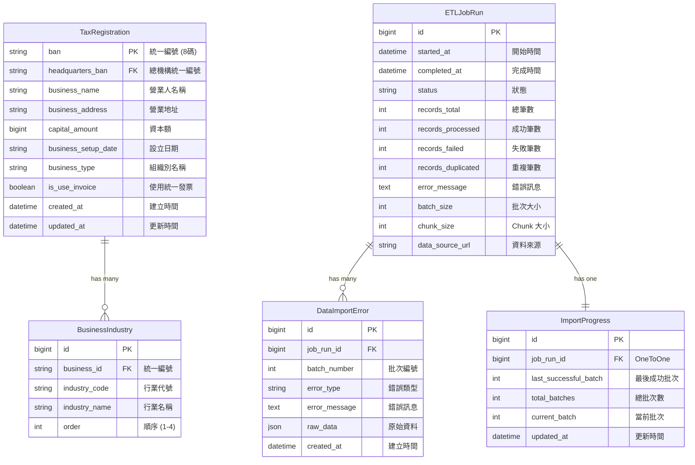

##### 業務資料模型設計

**TaxRegistration（營業登記主表）**

| 設計決策 | 說明 |
|----------|------|
| **使用統一編號作為 Primary Key** | 統一編號在台灣具有唯一性，直接作為 PK 可避免額外的 auto-increment ID，查詢時也不需要 JOIN |
| **BigIntegerField 儲存資本額** | 部分企業資本額超過 21 億（Integer 上限），使用 BigInteger 避免溢位 |
| **設立日期使用 CharField** | 原始資料格式為 `YYYYMMDD` 字串，部分資料有格式問題，保留原始格式便於追溯 |
| **建立時間使用 db_default=Now()** | PostgreSQL COPY 會跳過 Django ORM，需要資料庫層級的預設值 |

**BusinessIndustry（營業項目）**

| 設計決策 | 說明 |
|----------|------|
| **獨立成表而非 JSON 欄位** | 便於查詢「所有從事某行業的公司」，支援索引優化 |
| **複合唯一約束** | `(business, industry_code)` 確保同一公司不會有重複的行業代號 |
| **order 欄位** | 記錄行業的優先順序（主要行業為 1，次要為 2-4） |
| **使用 ForeignKey 而非嵌入** | 一家公司最多 4 個行業，關聯查詢成本可接受，且便於獨立維護 |

##### ETL 追蹤模型設計

**ETLJobRun（執行紀錄）**

這是 ETL 追蹤的核心表，每次執行 `load_tax_registration` 都會建立一筆記錄。

| 欄位 | 用途 |
|------|------|
| `status` | 追蹤執行狀態：`running` → `success` / `failed` / `partial` |
| `records_*` | 統計數據：總筆數、成功、失敗、重複，用於執行報告 |
| `batch_size` / `chunk_size` | 記錄執行參數，便於效能分析與問題重現 |
| `data_source_url` | 記錄資料來源，支援多資料源場景 |
| `error_message` | 失敗時記錄錯誤訊息，便於快速診斷 |

**DataImportError（錯誤明細）**

記錄每一筆驗證失敗的資料，支援問題資料的追溯與修正。

| 欄位 | 用途 |
|------|------|
| `batch_number` | 記錄錯誤發生在哪個批次，便於定位問題 |
| `error_type` | 分類錯誤類型：`INVALID_BAN`（格式錯誤）、`DUPLICATE`（重複資料） |
| `raw_data` | 以 JSON 格式保存原始資料，便於人工檢視與修正 |

設計考量：每批次最多記錄 100 筆錯誤，避免異常資料導致錯誤表爆量。

**ImportProgress（斷點續傳）**

與 `ETLJobRun` 是 OneToOne 關係，專門追蹤處理進度。

| 欄位 | 用途 |
|------|------|
| `last_successful_batch` | 最後成功完成的批次編號，斷點續傳的依據 |
| `current_batch` | 當前正在處理的批次，用於即時監控 |
| `total_batches` | 預估總批次數（若可預先得知） |

分離成獨立表的原因：進度資訊更新頻繁（每批次一次），與 `ETLJobRun` 的其他欄位更新頻率不同，分離可減少 row lock 競爭。


#### ETL Pipeline 整體流程

整個 ETL 流程由 `load_tax_registration` command 作為入口點，協調四個核心元件依序執行：

```
使用者執行 ./run etl
        │
        ▼
┌──────────────────────────────────────────────────────────────────┐
│                    load_tax_registration                         │
│                     (ETL 主控制器)                                │
│                                                                  │
│  1. 解析參數（--truncate / --resume / --dry-run / --limit）       │
│  2. 檢查是否有正在執行的任務（防止重複執行）                         │
│  3. 初始化 ETLTracker 建立執行記錄                                │
│  4. 依序呼叫 Extract → Transform → Load                          │
│  5. 更新執行狀態（success / failed）                              │
└──────────────────────────────────────────────────────────────────┘
        │
        ▼
┌─────────────┐     ┌─────────────┐     ┌─────────────┐
│   Extract   │ ──▶ │  Transform  │ ──▶ │    Load     │
│ CSVExtractor│     │TaxData      │     │ BulkLoader  │
│             │     │Transformer  │     │             │
└─────────────┘     └─────────────┘     └─────────────┘
        │                   │                   │
        ▼                   ▼                   ▼
  從政府網站下載       驗證、清洗、去重      PostgreSQL COPY
  CSV 並分批讀取       每批次獨立處理        批次寫入資料庫
        │                   │                   │
        └───────────────────┴───────────────────┘
                            │
                            ▼
                    ┌─────────────┐
                    │ ETLTracker  │
                    │  (執行追蹤)  │
                    └─────────────┘
                            │
                            ▼
                  記錄進度、錯誤、統計數據
                  支援斷點續傳與錯誤分析
```

#### 各元件職責說明

**1. CSVExtractor（Extract 階段）**

負責從遠端 URL 下載 CSV 檔案，並以 Generator 方式分批返回 DataFrame。這個設計確保即使 CSV 檔案有 300MB，記憶體中同一時間也只會存在一個批次的資料（約 50,000 筆）。

主要職責：
- 建立帶有重試機制的 HTTP Session（遇到 429、500、502、503、504 會自動重試 3 次）
- 使用 `stream=True` 串流下載，避免一次載入整個回應到記憶體
- 透過 pandas `read_csv()` 的 `chunksize` 參數，以 Generator 形式逐批產出 DataFrame
- 統一處理編碼（UTF-8）與空值識別（空字串、NULL、null、NA、N/A）

**2. TaxDataTransformer（Transform 階段）**

負責資料清洗與驗證，確保進入資料庫的資料符合 Schema 要求。每個批次獨立處理，返回清洗後的 DataFrame 與錯誤清單。

主要職責：
- 移除完全空白的資料列
- 驗證必填欄位存在（統一編號、營業人名稱）
- 驗證統一編號格式（必須為 8 位數字）
- 處理批次內重複資料（保留第一筆，其餘標記為 DUPLICATE 錯誤）
- 清理字串前後空白
- 返回 `(df_clean, errors)` 元組，讓呼叫端決定如何處理錯誤

**3. BulkLoader（Load 階段）**

負責將清洗後的資料批次寫入 PostgreSQL。這是效能最關鍵的元件，直接決定整體 ETL 的執行時間。

主要職責：
- 使用 PostgreSQL `COPY` 協定進行批次寫入（比 Django ORM 的 `bulk_create` 快 10-100 倍）
- 在 Transaction 中同時處理主表（`TaxRegistration`）與關聯表（`BusinessIndustry`）
- 處理 NULL 值的特殊格式（`\N`）以符合 COPY 協定要求
- 行業資料使用 `bulk_create` 搭配 `ignore_conflicts=True`，處理重複資料

**4. ETLTracker（執行追蹤）**

貫穿整個 ETL 流程的追蹤元件，負責記錄執行狀態與統計數據，並支援斷點續傳功能。

主要職責：
- 建立 `ETLJobRun` 記錄，追蹤執行狀態（running → success/failed）
- 維護即時統計數據（總處理筆數、成功筆數、失敗筆數、重複筆數）
- 記錄每批次的錯誤明細到 `DataImportError` 表
- 更新 `ImportProgress` 記錄最後成功的批次號碼
- 提供 `get_resume_batch()` 方法，支援從上次中斷處繼續
- 失敗批次的原始資料匯出到 CSV 檔案，便於人工檢視

#### 執行模式說明

| 模式 | 指令 | 說明 |
|------|------|------|
| **完整匯入** | `./run etl` | 清空現有資料，重新匯入全部記錄 |
| **Dry Run** | `./run dry-run` | 只執行 Extract 與 Transform，不實際寫入資料庫，用於驗證資料品質 |
| **斷點續傳** | `./run resume` | 從上次失敗的批次繼續執行，避免重新處理已完成的批次 |
| **限制筆數** | `./run etl --limit 10000` | 只處理前 N 筆，用於開發測試 |

#### 錯誤處理策略

系統採用「記錄並繼續」的錯誤處理策略，而非「遇錯即停」：

1. **單筆資料錯誤**：記錄到 `DataImportError` 表，該批次其餘資料繼續處理
2. **整批次失敗**：記錄錯誤、匯出原始資料到 CSV、詢問是否繼續處理下一批次
3. **網路錯誤**：HTTP 請求內建重試機制，3 次失敗後才拋出例外
4. **資料庫錯誤**：Transaction 回滾確保資料一致性，記錄失敗狀態後終止

這種設計確保 160 萬筆資料中即使有少量問題資料，也不會阻擋整體 ETL 流程的完成。
---

### 2. 架構圖

#### ETL 資料流程總覽

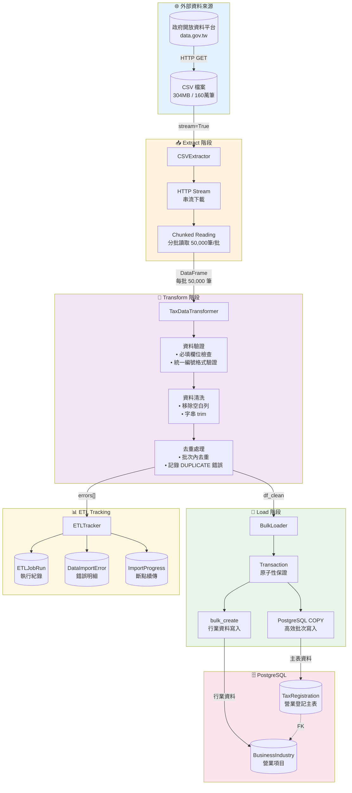

#### 批次處理流程

單一批次（Chunk）從讀取到寫入的完整流程：

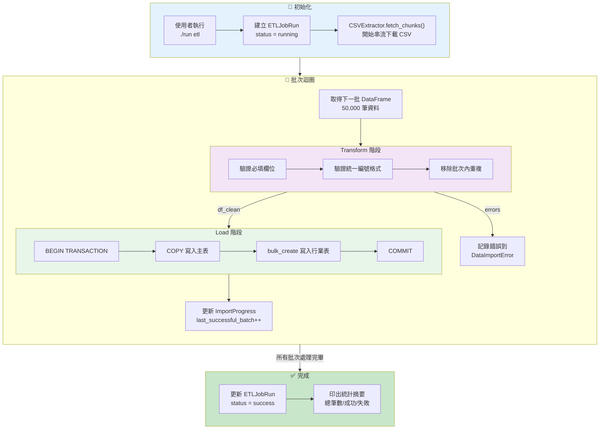

#### 單一批次處理細節

以下展示每個批次內部的資料流動：

```
┌─────────────────────────────────────────────────────────────────────┐
│  批次 N (50,000 筆原始資料)                                          │
├─────────────────────────────────────────────────────────────────────┤
│                                                                     │
│  ┌──────────────┐    ┌──────────────┐    ┌──────────────┐          │
│  │   原始資料    │    │   清洗後資料  │    │   寫入結果   │          │
│  │   50,000 筆  │ ──▶│   49,850 筆  │ ──▶│   49,850 筆  │          │
│  └──────────────┘    └──────────────┘    └──────────────┘          │
│         │                   │                                       │
│         │ 驗證失敗          │                                       │
│         ▼                   │                                       │
│  ┌──────────────┐          │                                       │
│  │   錯誤記錄    │          │                                       │
│  │   150 筆     │◀─────────┘                                       │
│  │ • INVALID_BAN: 80                                               │
│  │ • DUPLICATE: 70                                                  │
│  └──────────────┘                                                   │
│                                                                     │
└─────────────────────────────────────────────────────────────────────┘
```

#### 斷點續傳機制

當 ETL 中斷後，如何從上次成功的批次繼續：

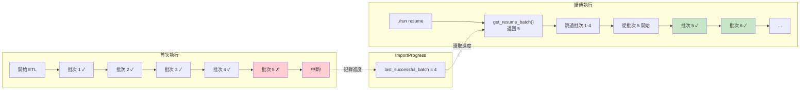

#### 錯誤處理流程

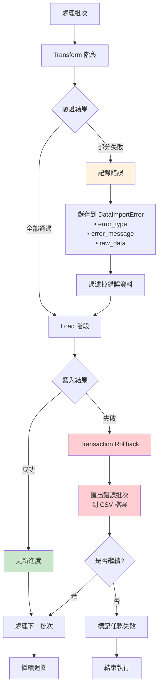

#### 資料驗證規則

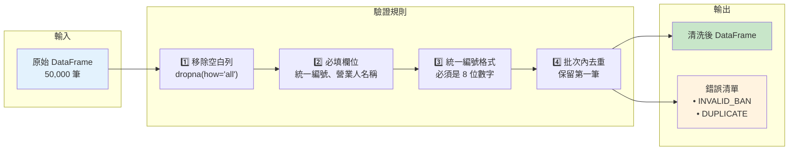

### 3. 技術選型理由

#### 資料庫選擇：PostgreSQL

**選擇 PostgreSQL 的關鍵理由**：`COPY` 協定提供比 `INSERT` 快 10-100 倍的批次寫入效能，對於 160 萬筆資料的場景至關重要。

#### 批次寫入策略：PostgreSQL COPY vs Django ORM

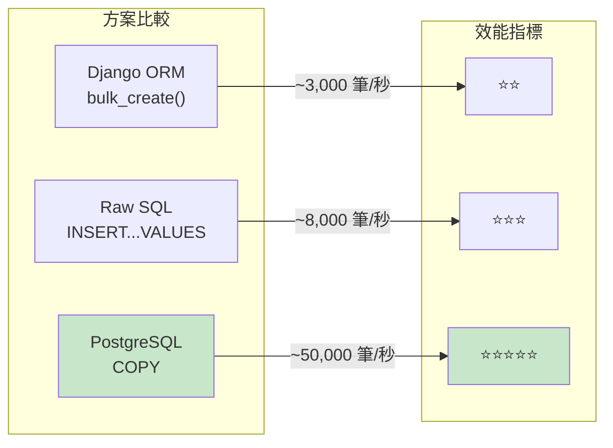

| 方案 | 寫入速度 | 優點 | 缺點 |
|------|----------|------|------|
| **Django bulk_create** | ~3,000 筆/秒 | 使用 ORM，支援 `auto_now_add` | 會產生大量 INSERT 語句 |
| **Raw SQL INSERT** | ~8,000 筆/秒 | 可批次 INSERT 多筆 | 需手動處理 SQL 注入防護 |
| **PostgreSQL COPY** | ~50,000 筆/秒 | 最快，直接寫入 WAL | 跳過 ORM，需手動處理預設值 |

**本專案選擇**：主表（`TaxRegistration`）使用 `COPY`，關聯表（`BusinessIndustry`）使用 `bulk_create`。

原因：
- 主表資料量大（160 萬筆），效能優先
- 關聯表資料量較小，且需要處理 `ignore_conflicts=True`，ORM 較方便

**COPY 的限制與解決方案**：

| 限制 | 說明 | 解決方案 |
|------|------|----------|
| 跳過 `auto_now_add` | COPY 不經過 Django ORM | 使用 `db_default=Now()` 讓資料庫自動填入 |
| 無法使用 Model Validation | 資料不經過 `full_clean()` | 在 Transform 階段預先驗證 |
| NULL 值格式特殊 | 需使用 `\N` 表示 NULL | 在 `BulkLoader` 中轉換格式 |

#### 資料讀取策略：pandas Chunked Reading

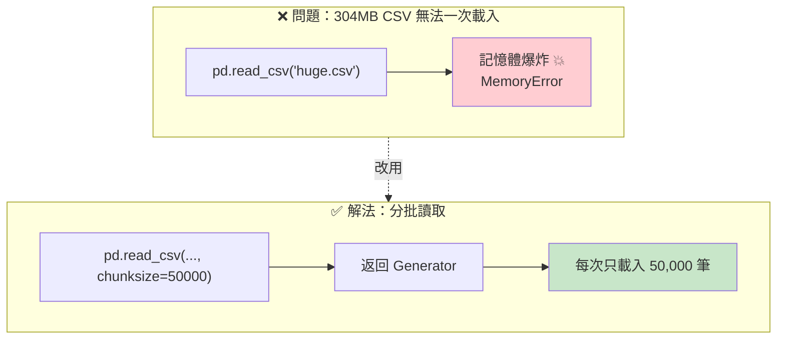

**選擇 pandas 的理由**：
- 160 萬筆屬於中型資料集，單機 + 分批即可處理
- DataFrame API 便於資料清洗（`dropna`、`duplicated`、`str.strip` 等）
- 團隊熟悉度高，維護成本低
- 不需要額外的分散式環境（Spark/Dask）

**Chunk Size 的選擇（50,000）**：

| Chunk Size | 記憶體使用 | 批次數量 | 適用場景 |
|------------|------------|----------|----------|
| 10,000 | ~50MB | ~160 批 | 記憶體受限環境 |
| **50,000** | ~250MB | ~32 批 | **平衡點（本專案選擇）** |
| 100,000 | ~500MB | ~16 批 | 記憶體充足環境 |

選擇 50,000 的考量：
- 記憶體用量適中（約 250MB/批）
- 批次數量合理（3X 批），進度更新不會太頻繁
- 單批處理時間約 2-3 秒，失敗時損失可接受

#### 資料驗證策略：Transform 階段預驗證

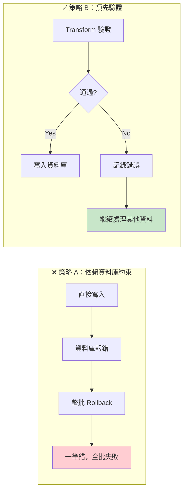

**選擇預驗證的理由**：

| 面向 | 依賴資料庫約束 | 預先驗證（本專案） |
|------|----------------|-------------------|
| **錯誤粒度** | 整批失敗 | 單筆失敗，其餘繼續 |
| **錯誤訊息** | 資料庫錯誤，較難讀 | 自訂訊息，清楚標示問題 |
| **效能** | 寫入後才發現錯誤 | 早期發現，減少無效 I/O |
| **可追溯性** | 需額外記錄 | 驗證時直接記錄到 `DataImportError` |

#### HTTP 下載策略：Stream + Retry

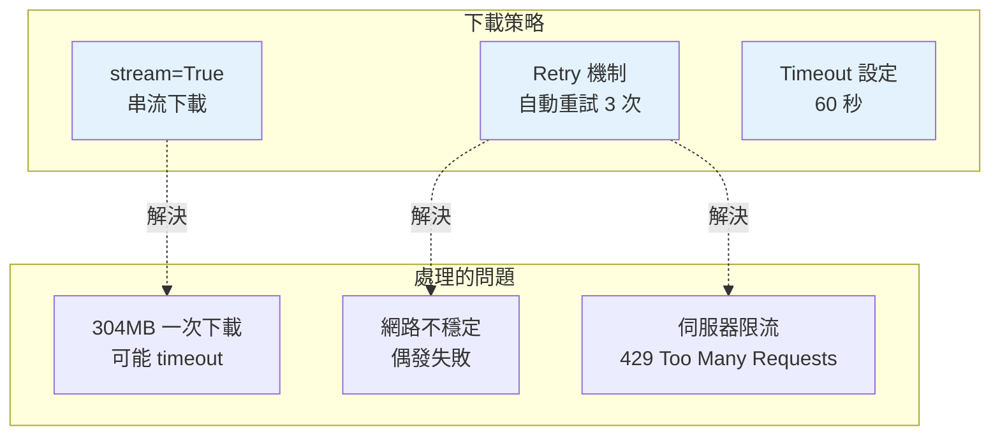

**Retry 設定說明**：

```
Retry(
    total=3,                    # 最多重試 3 次
    backoff_factor=1,           # 重試間隔：1s, 2s, 4s（指數退避）
    status_forcelist=[          # 遇到這些狀態碼才重試
        429,  # Too Many Requests
        500,  # Internal Server Error
        502,  # Bad Gateway
        503,  # Service Unavailable
        504   # Gateway Timeout
    ]
)
```

#### 技術選型總結

| 決策點 | 選擇 | 關鍵理由 |
|--------|------|----------|
| 資料庫 | PostgreSQL | COPY 協定提供最佳批次寫入效能 |
| 主表寫入 | PostgreSQL COPY | 160 萬筆資料，效能優先 |
| 關聯表寫入 | Django bulk_create | 資料量小，需要 `ignore_conflicts` |
| 資料讀取 | pandas + chunksize | DataFrame API 便於清洗，分批控制記憶體 |
| Chunk Size | 50,000 | 平衡記憶體用量與批次數量 |
| 驗證策略 | Transform 預驗證 | 單筆失敗不影響整批，錯誤可追溯 |
| HTTP 下載 | Stream + Retry | 處理大檔案與網路不穩定 |


### 4. 程式邏輯說明

#### 程式碼結構

```
core/tax_registration/
├── management/commands/
│   └── load_tax_registration.py   # ETL 入口點（Management Command）
├── etl/
│   ├── extractor.py               # Extract：CSV 下載與分批讀取
│   ├── transformer.py             # Transform：資料清洗與驗證
│   ├── loader.py                  # Load：批次寫入資料庫
│   └── tracker.py                 # 執行追蹤與斷點續傳
├── models.py                      # 資料模型定義
├── admin.py                       # Django Admin 設定
└── tasks.py                       # Django-Q2 排程任務
```

#### 入口點：load_tax_registration Command

`load_tax_registration` 是整個 ETL 的入口點，負責協調各元件的執行順序。

**支援的參數**

| 參數 | 說明 | 預設值 |
|------|------|--------|
| `--truncate` | 清空現有資料後重新匯入 | False |
| `--resume` | 從上次中斷處繼續 | False |
| `--dry-run` | 只執行 Extract/Transform，不寫入資料庫 | False |
| `--limit N` | 限制處理筆數（測試用） | None（全部） |
| `--batch-size N` | 資料庫寫入批次大小 | 5,000 |
| `--chunk-size N` | CSV 讀取批次大小 | 50,000 |
| `--auto` | 跳過確認提示（排程用） | False |

**執行流程**

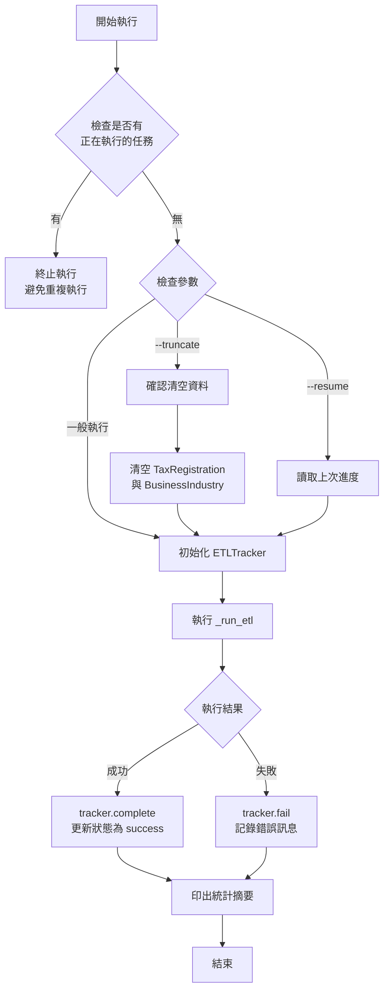

**防止重複執行機制**

每次執行前會檢查是否有 `status='running'` 的 `ETLJobRun` 記錄。若有，代表上一次執行尚未完成（可能正在執行或異常中斷），此時會拒絕新的執行請求。這個設計避免了：

- 兩個 ETL 同時寫入造成資料重複
- 資料庫連線池耗盡
- 記憶體不足

---

#### CSVExtractor：資料擷取

負責從政府開放資料平台下載 CSV 檔案，並以 Generator 方式分批返回 DataFrame。

**核心方法**

| 方法 | 職責 |
|------|------|
| `fetch_chunks(chunk_size)` | 下載 CSV 並返回 DataFrame Generator |
| `_create_session()` | 建立帶有重試機制的 HTTP Session |

**處理流程**

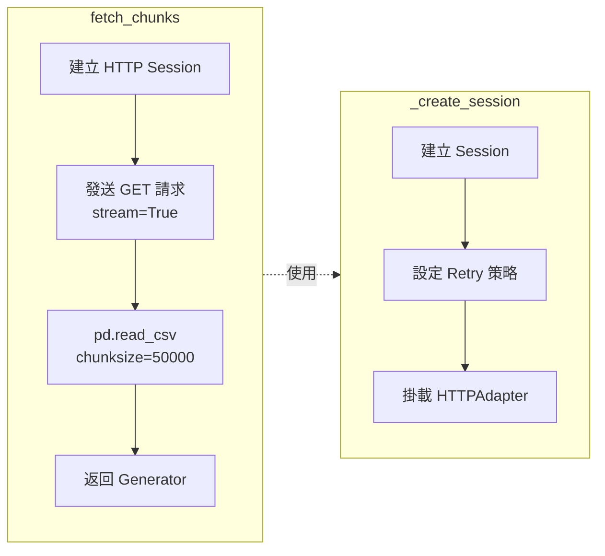

**關鍵設計**

1. **串流下載**：使用 `stream=True` 避免一次將 304MB 載入記憶體
2. **重試機制**：遇到 429/5xx 錯誤時自動重試，指數退避（1s → 2s → 4s）
3. **統一編碼**：強制使用 UTF-8 編碼讀取
4. **空值處理**：將空字串、NULL、null、NA、N/A 統一視為空值

---

#### TaxDataTransformer：資料轉換

負責資料清洗與驗證，確保進入資料庫的資料符合 Schema 要求。

**核心方法**

| 方法 | 輸入 | 輸出 |
|------|------|------|
| `process(df, chunk_num)` | 原始 DataFrame | `(df_clean, errors)` 元組 |

**驗證規則與處理順序**

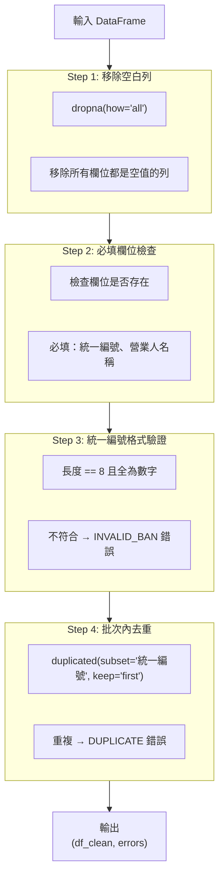

**錯誤記錄格式**

每筆驗證錯誤都會被記錄為一個 dict，包含：

| 欄位 | 說明 | 範例 |
|------|------|------|
| `type` | 錯誤類型 | `INVALID_BAN` / `DUPLICATE` |
| `batch` | 批次編號 | `5` |
| `ban` | 統一編號 | `1234567` |
| `message` | 錯誤訊息 | `統一編號格式錯誤: 1234567` |

---

#### BulkLoader：資料載入

負責將清洗後的資料批次寫入 PostgreSQL，是效能最關鍵的元件。

**核心方法**

| 方法 | 職責 |
|------|------|
| `insert(df)` | 主要入口，協調寫入流程 |
| `_prepare_tax_records(df)` | 準備主表資料 |
| `_bulk_insert_copy(df)` | 使用 COPY 協定寫入主表 |
| `_prepare_industry_records(df)` | 準備行業資料 |
| `_bulk_insert_industries(records)` | 使用 bulk_create 寫入行業表 |

**寫入流程**

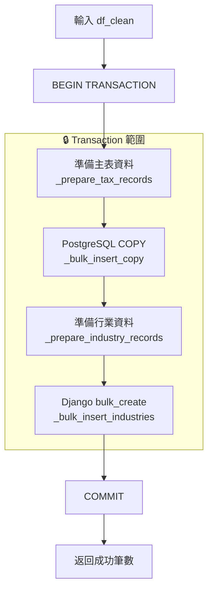

**COPY 協定寫入細節**

`_bulk_insert_copy` 方法的處理步驟：

1. **建立 StringIO Buffer**：在記憶體中建立一個類檔案物件
2. **轉換 NULL 值**：將 Python 的 `None` 和空字串轉換為 PostgreSQL COPY 格式的 `\N`
3. **寫入 TSV 格式**：使用 Tab 作為分隔符號，避免資料中的逗號造成問題
4. **執行 COPY**：透過 `cursor.copy_from()` 直接寫入資料庫

**行業資料處理**

每筆營業登記最多有 4 個行業別（行業代號、行業代號1、行業代號2、行業代號3）。`_prepare_industry_records` 方法會：

1. 遍歷每筆資料
2. 檢查 4 個行業欄位是否有值
3. 建立 `BusinessIndustry` 物件，設定 `order` 為 1-4
4. 使用 `ignore_conflicts=True` 處理可能的重複

---

#### ETLTracker：執行追蹤

貫穿整個 ETL 流程的追蹤元件，負責記錄執行狀態並支援斷點續傳。

**核心方法**

| 方法 | 職責 |
|------|------|
| `start()` | 建立 ETLJobRun 記錄，狀態設為 running |
| `complete()` | 標記執行成功，更新統計數據 |
| `fail(error)` | 標記執行失敗，記錄錯誤訊息 |
| `record_errors(errors, chunk_num)` | 將驗證錯誤寫入 DataImportError |
| `update_progress(chunk_num)` | 更新 ImportProgress，記錄最後成功批次 |
| `get_resume_batch()` | 取得斷點續傳的起始批次號碼 |
| `save_error_batch(df, chunk_num, error)` | 將失敗批次的原始資料匯出到 CSV |

**狀態管理流程**

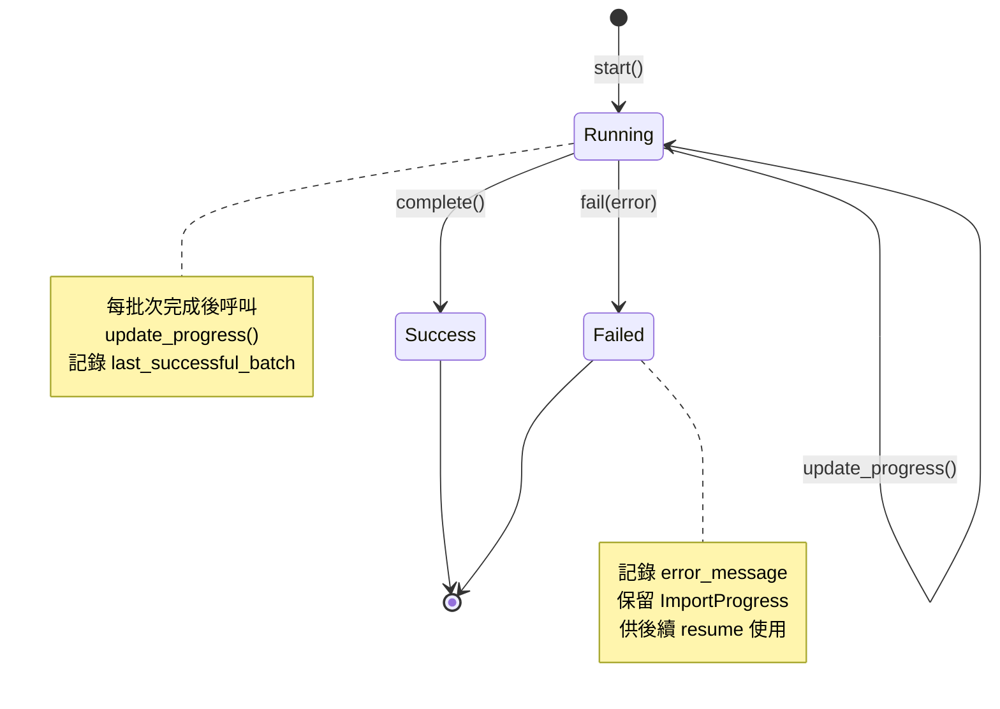

**統計數據追蹤**

ETLTracker 內部維護一個 `stats` 字典，追蹤以下數據：

| 欄位 | 說明 | 更新時機 |
|------|------|----------|
| `total` | 總處理筆數 | 每批次 Transform 後 |
| `success` | 成功寫入筆數 | 每批次 Load 後 |
| `failed` | 驗證失敗筆數 | 每批次 Transform 後 |
| `duplicates` | 重複資料筆數 | 每批次 Transform 後 |

**斷點續傳實作**

`get_resume_batch()` 方法的邏輯：

1. 查詢最近一筆 `status='running'` 的 ETLJobRun
2. 取得該 Job 的 ImportProgress 記錄
3. 返回 `last_successful_batch + 1` 作為續傳起點
4. 若無記錄則返回 1（從頭開始）

---

#### 排程整合：Django-Q2 Tasks

`tasks.py` 中定義了供 Django-Q2 排程呼叫的任務函數。

**定義的任務**

| 函數 | 說明 |
|------|------|
| `run_tax_import()` | 完整匯入（等同 `./run etl --auto`） |
| `run_tax_import_dry_run()` | Dry Run 模式（測試用） |

**與 Django-Q2 的整合方式**

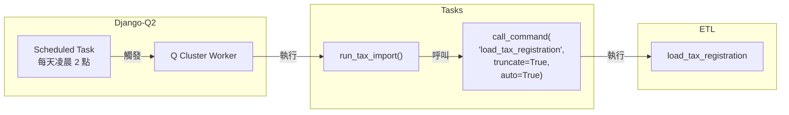

**為何使用 `call_command()` 而非直接呼叫函數？**

| 方式 | 優點 | 缺點 |
|------|------|------|
| `call_command()` | 參數解析、輸出處理都由 Django 管理 | 多一層呼叫 |
| 直接呼叫內部函數 | 稍快 | 需自行處理參數、stdout、錯誤 |

選擇 `call_command()` 確保排程執行與手動執行的行為完全一致。

## 🐳 題目二：數據應用服務

### 1. 設計概念

題目二要求將題目一的 ETL 服務容器化，並增加排程更新機制。本專案的設計重點：

| 要求 | 實作方式 |
|------|----------|
| **數據服務容器化** | Docker Compose 編排多服務架構 |
| **Log 可解讀性高** | JSON 結構化日誌 + 自訂 extra 欄位 |
| **定時排程** | Django-Q2 搭配 Admin UI 管理 |

#### 容器化設計原則

| 原則 | 實踐 |
|------|------|
| **單一職責** | 每個 Container 只負責一件事（Django / PostgreSQL / Q-Worker / CloudWatch Agent） |
| **服務依賴** | 使用 `depends_on` + `healthcheck` 確保啟動順序 |
| **非 Root 執行** | Django Container 使用 `django` 用戶執行，提升安全性 |
| **Volume 持久化** | 資料庫資料與 Log 檔案使用 Named Volume |

---

### 2. 架構圖

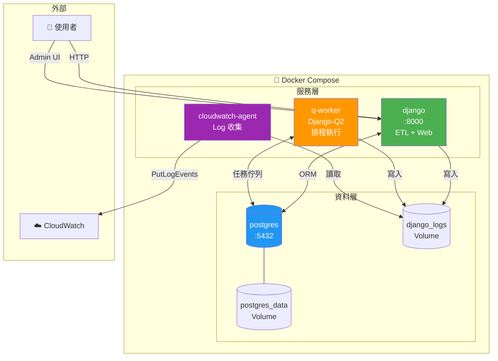

#### 服務說明

| 服務 | Image | 職責 |
|------|-------|------|
| `django` | 自建 | Django Web Server + ETL 入口 |
| `postgres` | postgres:15 | 資料儲存 |
| `q-worker` | 自建（同 django） | Django-Q2 Worker，執行排程任務 |
| `cloudwatch-agent` | amazon/cloudwatch-agent | 收集 Log 檔案並推送至 CloudWatch |

---

### 3. 技術選型理由

#### 排程方案比較

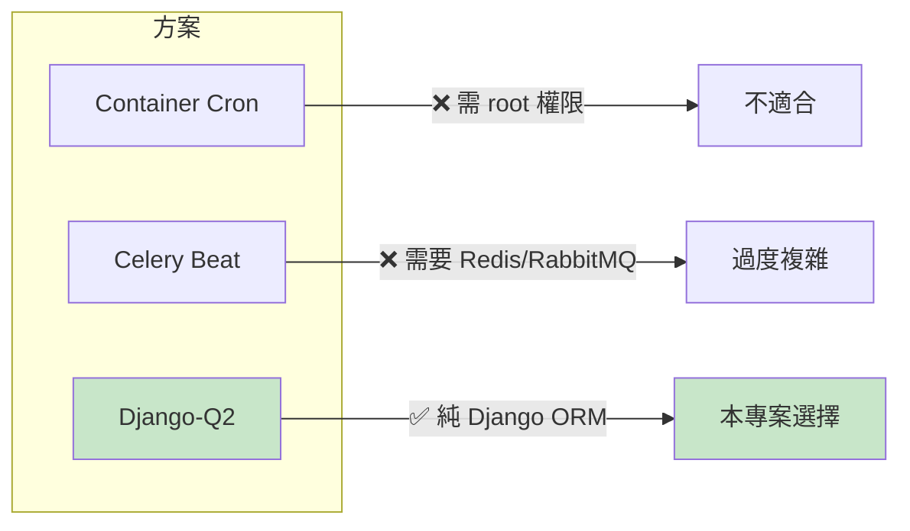

| 方案 | 優點 | 缺點 | 適用場景 |
|------|------|------|----------|
| **Container Cron** | 簡單 | 需 root、無 retry、難監控 | 極簡單任務 |
| **Celery Beat** | 功能強大、分散式 | 需額外 Broker（Redis） | 大型系統 |
| **Django-Q2** | 純 ORM、Admin UI 管理、內建 retry | 不支援分散式 | 中小型 Django 專案 |

**選擇 Django-Q2 的理由**：
- 不需要額外的 Redis/RabbitMQ，直接使用 PostgreSQL 作為 Broker
- 內建 Admin UI，可在網頁上管理排程與查看執行結果
- 支援 timeout 與 retry，適合長時間執行的 ETL 任務

#### Log 可解讀性設計

| 設計 | 說明 |
|------|------|
| **JSON 格式** | 使用 `python-json-logger`，便於 CloudWatch Metric Filter 解析 |
| **Extra 欄位** | 每筆 Log 帶有 `event`、`job_run_id`、`batch_num` 等上下文 |
| **Console 彩色輸出** | 開發時使用 `PrettyFormatter`，方便人眼閱讀 |

Log 範例：
```json
{
  "timestamp": "2026-01-28T10:30:00+0800",
  "level": "INFO",
  "name": "tax_registration.etl",
  "message": "批次處理完成",
  "event": "batch_completed",
  "job_run_id": 42,
  "batch_num": 5,
  "records_success": 49850
}
```

#### Dockerfile 最佳化

| 技術 | 效果 |
|------|------|
| **Multi-stage Build** | 最終 Image 不含編譯工具（gcc），體積減少約 200MB |
| **Non-root User** | 以 `django` 用戶執行，避免容器逃逸風險 |
| **PYTHONUNBUFFERED=1** | Log 即時輸出，不經過緩衝區 |
| **Healthcheck** | 確保服務真正可用後才接受流量 |

---

### 4. 程式邏輯說明

#### Django-Q2 設定

```
Q_CLUSTER = {
    "name": "ETL_Cluster",
    "workers": 1,              # 單一 Worker 避免並發 ETL
    "timeout": 7200,           # 2 小時（ETL 可能跑很久）
    "retry": 7300,             # 重試時間略長於 timeout
    "orm": "default",          # 使用 PostgreSQL 作為 Broker
    "catch_up": False,         # 不補跑錯過的任務
}
```

**關鍵參數說明**

| 參數 | 值 | 理由 |
|------|-----|------|
| `workers: 1` | 單一 Worker | ETL 是 full refresh，同時跑兩個會衝突 |
| `timeout: 7200` | 2 小時 | 160 萬筆資料完整匯入約需 30-60 分鐘，預留緩衝 |
| `catch_up: False` | 不補跑 | ETL 每次都是 truncate + 重建，補跑沒意義 |

#### 排程任務定義

`tasks.py` 中定義的任務：

| 函數 | 說明 |
|------|------|
| `run_tax_import()` | 完整 ETL（truncate + 匯入） |
| `run_tax_import_dry_run()` | Dry Run 模式（測試用） |

#### 服務啟動順序

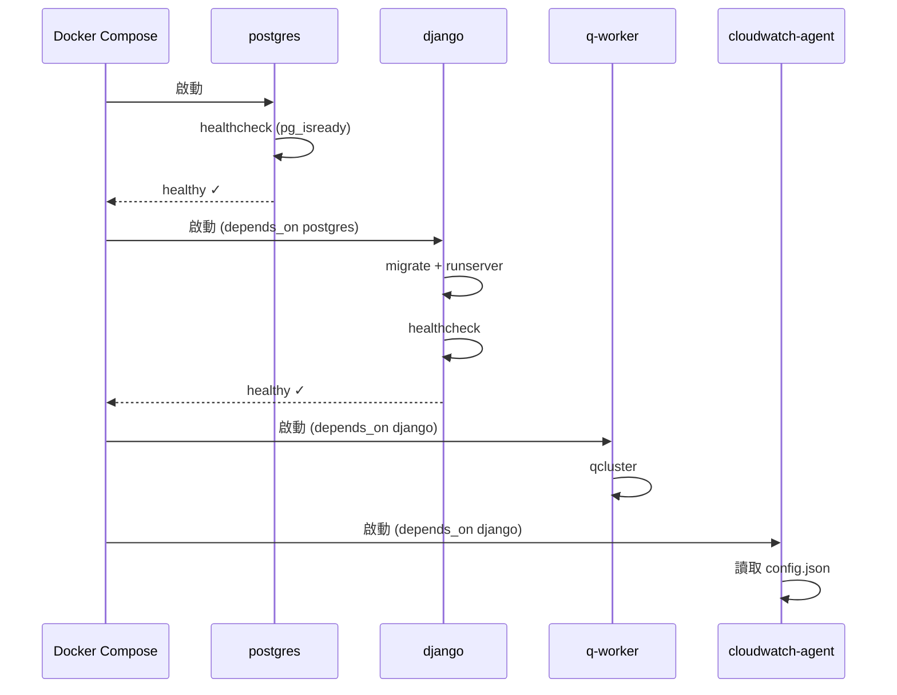

#### Volume 設計

| Volume | 掛載點 | 用途 |
|--------|--------|------|
| `postgres_data` | `/var/lib/postgresql/data` | 資料庫持久化 |
| `django_logs` | `/var/log/django` | Django 與 Q-Worker 共享 Log 目錄 |

`django_logs` 被三個服務共用：
- `django`：寫入 Log
- `q-worker`：寫入 Log
- `cloudwatch-agent`：讀取 Log 並推送至 AWS
---

## 🏗️ 題目三：Docker Log 蒐集 - IaC

### 1. 設計概念

本專案使用 **Terraform** 實現基礎設施即代碼（Infrastructure as Code），自動化部署所有 AWS 監控資源。

**核心設計原則：**

| 原則 | 實踐方式 |
|------|----------|
| **最小權限原則** | IAM Policy 僅授予 `logs:PutLogEvents` 等必要權限，並限定特定 Log Group |
| **資源命名規範** | 統一使用 `${project_name}-${resource}` 格式，便於識別與管理 |
| **環境變數分離** | 敏感資訊（Email、憑證）透過 `TF_VAR_*` 注入，不寫死在程式碼中 |
| **模組化設計** | 依資源類型分離 `.tf` 檔案，提高可讀性與維護性 |

---

### 2. 架構圖

```mermaid
flowchart TB
    subgraph Terraform["🏗️ Terraform 管理的資源"]
        subgraph IAM["IAM"]
            USER[IAM User<br/>log-writer]
            POLICY[IAM Policy<br/>CloudWatch Logs Write]
            KEY[Access Key]
            
            USER --> POLICY
            USER --> KEY
        end
        
        subgraph CloudWatch["CloudWatch"]
            LG[Log Group<br/>/docker/etl]
            
            subgraph Streams["Log Streams"]
                S1[console]
                S2[file]
            end
            
            subgraph Metrics["Metric Filters"]
                MF1[ErrorCount]
                MF2[ETLCompleted]
                MF3[ETLFailed]
                MF4[RecordsProcessed]
            end
            
            subgraph Alarms["Alarms"]
                A1[High Error Count]
                A2[ETL Failed]
            end
            
            DB[Dashboard]
            
            LG --> S1
            LG --> S2
            LG --> MF1
            LG --> MF2
            LG --> MF3
            LG --> MF4
            MF1 --> A1
            MF3 --> A2
            MF1 & MF2 & MF3 & MF4 --> DB
            A1 & A2 --> DB
        end
        
        subgraph SNS["SNS"]
            TOPIC[Topic<br/>etl-alerts]
            SUB[Email Subscription]
            
            TOPIC --> SUB
        end
        
        A1 --> TOPIC
        A2 --> TOPIC
    end
    
    SUB -->|"告警通知"| EMAIL[👤 Admin Email]
    KEY -->|"憑證供應"| DOCKER[🐳 Docker Containers]
    DOCKER -->|"寫入日誌"| LG

    style USER fill:#ff9800,color:#000
    style LG fill:#9c27b0,color:#fff
    style TOPIC fill:#e91e63,color:#fff
```

---

### 3. IAM 設計

本專案涉及兩個 IAM User，各有不同用途與權限範圍：

#### IAM User 總覽

| User | 建立方式 | 用途 | 生命週期 |
|------|----------|------|----------|
| `terraform-deployer` | 手動建立 | 執行 Terraform 部署 AWS 資源 | 長期保留 |
| `etl-log-demo-log-writer` | Terraform 建立 | Docker containers 寫入 CloudWatch Logs | 隨 Terraform 管理 |

#### 1. terraform-deployer（部署用）

**用途**：執行 `terraform apply` 建立/修改/刪除 AWS 資源

**附加的 AWS Managed Policies：**

| Policy | 理由 |
|--------|------|
| `CloudWatchFullAccess` | 建立 Log Group、Metric Filter、Alarm、Dashboard |
| `IAMFullAccess` | 建立 `log-writer` User 及其 Policy、Access Key |
| `AmazonSNSFullAccess` | 建立 SNS Topic 與 Email Subscription |

**為什麼使用 Managed Policies？**
- 部署階段需要較廣泛的權限來建立各類資源
- Managed Policies 由 AWS 維護，自動涵蓋服務新增的 API
- 部署完成後此 User 不再使用，風險可控

#### 2. etl-log-demo-log-writer（運行時用）

**用途**：供 Watchtower 與 CloudWatch Agent 寫入日誌

**附加的 Custom Policy（最小權限設計）：**

```
Policy: etl-log-demo-cloudwatch-logs-write

Actions:
  - logs:CreateLogGroup
  - logs:CreateLogStream
  - logs:PutLogEvents
  - logs:DescribeLogGroups
  - logs:DescribeLogStreams

Resources:
  - arn:aws:logs:ap-northeast-1:*:log-group:/docker/etl
  - arn:aws:logs:ap-northeast-1:*:log-group:/docker/etl:*
```

**為什麼使用 Custom Policy？**

| 設計決策 | 理由 |
|----------|------|
| **限定特定 Log Group** | 即使憑證外洩，攻擊者也無法存取其他 Log Group |
| **僅授予寫入權限** | 無法讀取、刪除日誌，降低資料外洩風險 |
| **包含 Describe 權限** | CloudWatch Agent 啟動時需要檢查 Log Group/Stream 是否存在 |

#### 為什麼選擇 IAM User 而非 IAM Role？

| 考量 | IAM User | IAM Role |
|------|----------|----------|
| **適用環境** | 本地 Docker Compose | AWS 服務（ECS/EC2/Lambda） |
| **憑證形式** | Access Key（長期） | 臨時憑證（自動輪替） |
| **本專案情境** | ✅ 本地開發為主 | ❌ 需部署至 AWS 才能使用 |

**結論**：本專案以本地 Docker Compose 執行為主要場景，IAM User + Access Key 是最直接的方案。若未來部署至 ECS，建議改用 Task IAM Role 以獲得自動憑證輪替的安全性。

---

### 4. Terraform 資源說明

#### 檔案結構

```
terraform/
├── main.tf                      # Provider 設定、後端配置
├── variables.tf                 # 輸入變數定義
├── outputs.tf                   # 輸出值（供 setup script 使用）
├── iam_user.tf                  # IAM User 與 Access Key
├── iam_policies.tf              # IAM Policy（最小權限）
├── cloudwatch_log_groups.tf     # Log Group 與 Streams
├── cloudwatch_metric_filters.tf # Metric Filters（從 log 提取指標）
├── cloudwatch_alarms.tf         # 告警規則
├── cloudwatch_dashboard.tf      # 可視化 Dashboard
├── sns.tf                       # SNS Topic 與 Email 訂閱
└── .env.aws                     # AWS 憑證範本（不納入版控）
```

#### 關鍵資源說明

| 資源 | 檔案 | 用途 |
|------|------|------|
| `aws_iam_user.log_writer` | `iam_user.tf` | 供 Docker containers 使用的寫入專用帳戶 |
| `aws_iam_policy.cloudwatch_logs_write` | `iam_policies.tf` | 限定只能寫入 `/docker/etl` Log Group |
| `aws_cloudwatch_log_metric_filter` | `cloudwatch_metric_filters.tf` | 從 JSON log 提取 `ErrorCount`、`ETLCompleted`、`ETLFailed`、`RecordsProcessed` 指標 |
| `aws_cloudwatch_metric_alarm` | `cloudwatch_alarms.tf` | 5 分鐘內 ≥5 ERROR 或 ETL 失敗時觸發告警 |
| `aws_sns_topic_subscription` | `sns.tf` | 告警觸發時發送 Email 通知 |

#### 變數設計

| 變數 | 預設值 | 說明 |
|------|--------|------|
| `project_name` | `etl-log-demo` | 資源命名前綴 |
| `aws_region` | `ap-northeast-1` | AWS 區域 |
| `log_retention_days` | `3` | Log 保留天數（Demo 用，生產建議 30-90） |
| `alarm_email` | （選填） | 告警通知信箱 |
---

## 📝 題目四：Docker Log 蒐集 - Log Implement

### 1. 設計概念

本系統採用**雙路徑收集策略**，同時支援題目要求的兩種 Docker log 收集場景：

| 收集路徑 | 來源 | 工具 | 適用場景 |
|----------|------|------|----------|
| **Console 路徑** | stdout/stderr | Watchtower | 應用程式直接輸出的即時日誌 |
| **File 路徑** | 實體檔案 | CloudWatch Agent | 需要持久化或輪替的日誌檔案 |

**核心設計原則：**

- **單一 Log Group，多 Stream 分流**：所有日誌集中到 `/docker/etl`，依來源分 `console` 與 `file` 兩個 Stream
- **JSON 結構化日誌**：使用 `python-json-logger` 確保日誌可被 CloudWatch Metric Filter 解析
- **統一時間戳格式**：ISO 8601 格式，便於跨 Stream 查詢與排序

---

### 2. Log 收集架構圖

```mermaid
flowchart TB
    subgraph Docker["🐳 Docker Container"]
        APP[Django ETL Application]
        LOG_FILE[("/var/log/django/etl.log")]
        
        APP -->|"logging.info()"| CONSOLE[stdout/stderr]
        APP -->|"RotatingFileHandler"| LOG_FILE
    end

    subgraph Collectors["📡 Log Collectors"]
        WT[Watchtower Handler<br/>in Django Process]
        CWA[CloudWatch Agent<br/>Sidecar Container]
    end

    subgraph AWS["☁️ AWS CloudWatch"]
        LG[("Log Group<br/>/docker/etl")]
        
        subgraph Streams["Log Streams"]
            S1[console]
            S2[file]
        end
        
        LG --> S1
        LG --> S2
    end

    CONSOLE -.->|"直接推送"| WT
    WT -->|"PutLogEvents API"| S1
    
    LOG_FILE -.->|"Volume 掛載"| CWA
    CWA -->|"PutLogEvents API"| S2

    style WT fill:#ff9800,color:#000
    style CWA fill:#2196f3,color:#fff
    style LG fill:#9c27b0,color:#fff
```

---

### 3. 技術選型：Log 收集方案比較

Docker 日誌送至 CloudWatch 有多種常見方案，以下為綜合比較：

| 方案 | 收集來源 | 部署方式 | 優點 | 缺點 |
|------|----------|----------|------|------|
| **Docker awslogs driver** | stdout/stderr | Docker daemon 設定 | 零程式碼、原生支援 | 憑證需在 host 層級、無法收集檔案 |
| **CloudWatch Agent** | 檔案 | Sidecar container | 支援檔案輪替、可收集 metrics | 需額外 container、有 flush 延遲 |
| **Watchtower** | Python logging | Application 內建 | 即時推送、可加 extra fields | 僅限 Python、與應用耦合 |
| **Fluent Bit** | stdout + 檔案 | Sidecar container | 輕量、多 output 支援 | 需學習設定語法、非 AWS 原生 |
| **AWS FireLens** | stdout/stderr | ECS 原生整合 | ECS 深度整合、支援 Fluent Bit | 僅限 ECS 環境 |

#### 本專案選擇：Watchtower + CloudWatch Agent

| 選擇理由 | 說明 |
|----------|------|
| **滿足題目要求** | 同時示範 console 與 file 兩種收集方式 |
| **AWS 原生整合** | 無需額外學習 Fluent Bit 設定語法 |
| **Django 友善** | Watchtower 可直接作為 logging handler，支援 `extra` 欄位 |
| **本地開發友善** | 不依賴 ECS，Docker Compose 即可運行 |


---

### 4. 建置手冊

#### 關鍵設定檔

| 檔案 | 用途 |
|------|------|
| `core/de/settings.py` | Django logging 設定，定義 Watchtower handler |
| `docker/cloudwatch-agent/config.json` | Agent 收集規則，指定檔案路徑與 Stream |
| `docker/cloudwatch-agent/.aws/credentials` | Agent 專用 IAM 憑證（由 setup 自動產生） |

#### 驗證日誌收集

```bash
# 1. 產生測試日誌
./run django-shell
>>> import logging
>>> logger = logging.getLogger('tax_registration.etl')
>>> logger.info("測試 console 路徑", extra={"event": "test"})

# 2. 檢查 CloudWatch Console
#    - Log Group: /docker/etl
#    - Stream: console（應看到上述日誌）
#    - Stream: file（應看到相同日誌，因為同時寫入檔案）
```
---

## 🧹 資源清理

當測試完成後，請依照以下步驟清理資源，避免產生不必要的 AWS 費用。

### 清理順序

```mermaid
flowchart LR
    A["1️⃣ 停止 Docker"] --> B["2️⃣ 銷毀 AWS 資源"]
    B --> C["3️⃣ 清理本地檔案"]
    
    style A fill:#e3f2fd
    style B fill:#fff3e0
    style C fill:#f3e5f5
```

---

### Step 1：停止 Docker Compose

```bash
./run down
```

這會停止並移除所有 Container，但保留 Volume（資料庫資料）。

如需完全清除 Volume：

```bash
docker compose down -v
```

---

### Step 2：銷毀 AWS 資源（Terraform）

```bash
./run tf-destroy
```

系統會提示確認：

```
確定要繼續嗎？(yes/no): yes
```

輸入 `yes` 後，Terraform 會銷毀以下資源：

| 資源類型 | 名稱 |
|----------|------|
| IAM User | `etl-log-demo-log-writer` |
| IAM Policy | `etl-log-demo-cloudwatch-logs-write` |
| CloudWatch Log Group | `/docker/etl` |
| CloudWatch Metric Filters | `ErrorCount`、`ETLCompleted` 等 |
| CloudWatch Alarms | `high-error-count`、`etl-failed` |
| CloudWatch Dashboard | `etl-dashboard` |
| SNS Topic | `etl-alerts` |

> ⚠️ **注意**：Log Group 內的日誌資料會一併刪除，無法復原。

---

### Step 3：清理本地檔案（選用）

如需清除自動產生的憑證檔案：

```bash
# 清除 CloudWatch Agent 憑證
rm -f docker/cloudwatch-agent/.aws/credentials

# 清除環境變數檔案（內含 AWS 憑證）
rm -f .env.local
```

---

### 一鍵清理（完整）

如果想一次完成所有清理：

```bash
# 停止 Docker + 銷毀 AWS 資源
./run cleanup
```

此指令會依序執行：
1. `docker compose down`
2. `terraform destroy -auto-approve`

---

### 清理確認 Checklist

| # | 項目 | 確認方式 | 狀態 |
|---|------|----------|------|
| 1 | Docker 已停止 | `docker ps` 無相關 container | ⬜ |
| 2 | Volume 已清除 | `docker volume ls` 無 `postgres_data`、`django_logs` | ⬜ |
| 3 | AWS IAM User 已刪除 | AWS Console → IAM → Users | ⬜ |
| 4 | CloudWatch Log Group 已刪除 | AWS Console → CloudWatch → Log groups | ⬜ |
| 5 | SNS Topic 已刪除 | AWS Console → SNS → Topics | ⬜ |
| 6 | 本地憑證已清除 | 檢查 `.env.local` 是否存在 | ⬜ |

---
