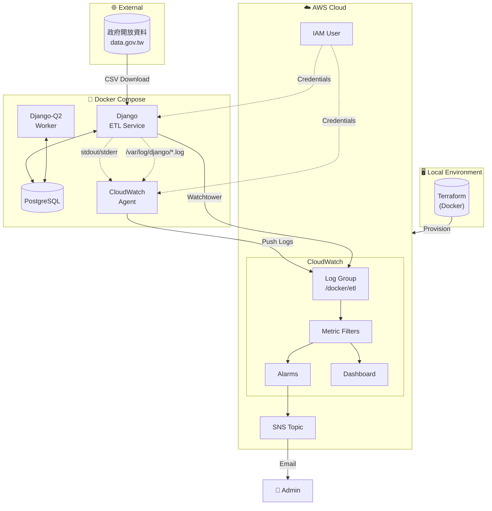
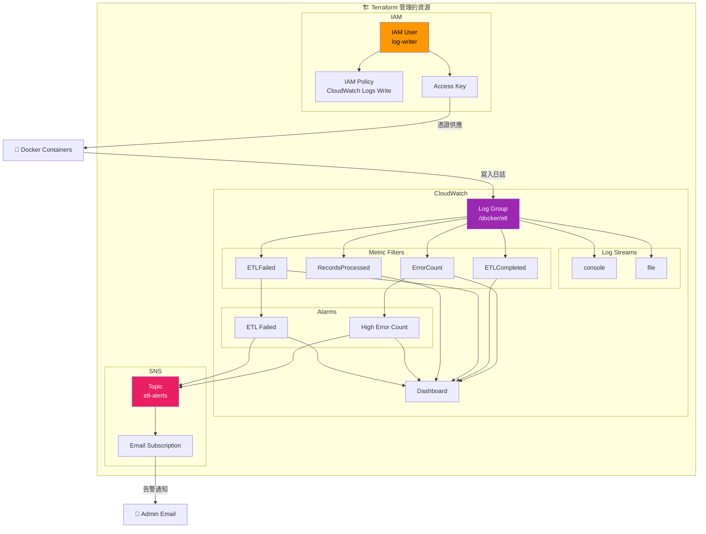
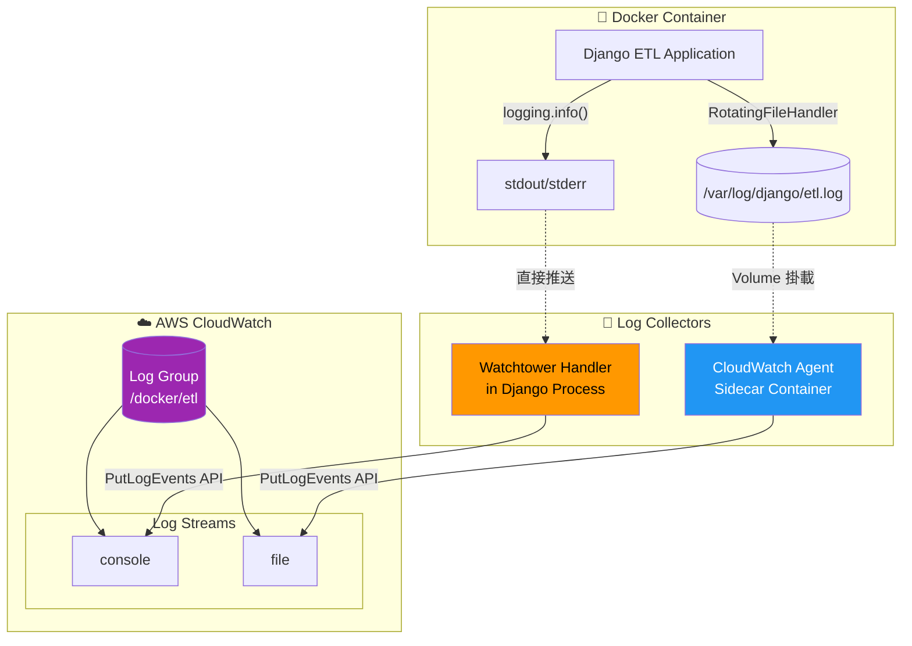

# 🏢 全國營業稅籍登記 ETL 系統

---

## 📋 目錄

- [專案概述](#-專案概述)
- [環境準備](#-環境準備)
- [快速開始](#-快速開始)
- [功能測試指南](#-功能測試指南)
- [題目一：數據資料收集](#-題目一數據資料收集)
- [題目二：數據應用服務](#-題目二數據應用服務)
- [題目三：Docker Log 蒐集 - IaC](#-題目三docker-log-蒐集---iac)
- [題目四：Docker Log 蒐集 - Log Implement](#-題目四docker-log-蒐集---log-implement)
- [資源清理](#-資源清理)
- [附錄](#-附錄)

---

## 🎯 專案概述

### 專案簡介

本專案為數據工程面試作業，實作一個完整的 ETL（Extract-Transform-Load）系統，從台灣政府開放資料平台擷取全國營業稅籍登記資料（約 304MB、160 萬筆），經過資料清洗與驗證後，批次匯入 PostgreSQL 資料庫。

系統採用容器化架構，透過 Docker Compose 編排多個服務，並使用 Terraform 實現基礎設施即代碼（IaC），自動化部署 AWS CloudWatch 監控資源。日誌收集採用雙路徑設計，同時支援 Console 輸出與實體檔案兩種收集方式。

### 技術棧

| 類別 | 技術 | 版本 | 用途 |
|------|------|------|------|
| **Backend** | Django | 6.0.1 | Web 框架、ETL 管理命令 |
| **Database** | PostgreSQL | 15 | 關聯式資料庫 |
| **Task Queue** | Django-Q2 | 1.9.0 | 背景任務排程 |
| **Data Processing** | pandas | 3.0.0 | CSV 讀取與資料清洗 |
| **Container** | Docker | 24+ | 容器化部署 |
| **Orchestration** | Docker Compose | 2.0+ | 多容器編排 |
| **IaC** | Terraform | 1.7 | AWS 基礎設施管理 |
| **Cloud** | AWS CloudWatch | - | 日誌收集、監控、告警 |
| **Logging** | Watchtower | 3.4.0 | CloudWatch 日誌整合 |
| **Logging** | python-json-logger | 4.0.0 | 結構化 JSON 日誌 |

### 系統架構總覽



---

## 🔧 環境準備

### 系統需求

| 軟體 | 最低版本 | 必要性 | 說明 |
|------|----------|--------|------|
| Docker | 24.0+ | ✅ 必要 | 容器運行環境 |
| Docker Compose | 2.0+ | ✅ 必要 | 多容器編排 |
| AWS CLI | 2.0+ | ✅ 必要 | AWS 憑證設定 |
| Git | 2.0+ | ✅ 必要 | 版本控制 |
| Poetry | 1.7+ | ⚪ 可選 | 本地開發用 |

### macOS 安裝

```bash
# 安裝 Homebrew（如果尚未安裝）
/bin/bash -c "$(curl -fsSL https://raw.githubusercontent.com/Homebrew/install/HEAD/install.sh)"

# 安裝 Docker Desktop（包含 Docker Compose）
brew install --cask docker

# 安裝 AWS CLI
brew install awscli

# 安裝 Git
brew install git

# （可選）安裝 Poetry - 本地開發用
brew install poetry

# 驗證安裝
docker --version
docker compose version
aws --version
git --version
```

> ⚠️ **注意**：安裝完 Docker Desktop 後，請確保已啟動應用程式。

### Windows 安裝

```powershell
# 使用 winget 安裝（Windows 11 內建，Windows 10 需另行安裝）

# 安裝 Docker Desktop
winget install Docker.DockerDesktop

# 安裝 AWS CLI
winget install Amazon.AWSCLI

# 安裝 Git
winget install Git.Git

# （可選）安裝 Poetry
winget install Python.Poetry

# 驗證安裝（重新開啟 PowerShell）
docker --version
docker compose version
aws --version
git --version
```

> ⚠️ **注意**：
> 1. Docker Desktop 需要啟用 WSL 2，安裝時會自動提示
> 2. 安裝完成後需重新啟動電腦
> 3. 首次啟動 Docker Desktop 需同意服務條款

### Linux (Ubuntu/Debian) 安裝

```bash
# 更新套件列表
sudo apt update

# 安裝 Docker
sudo apt install -y docker.io docker-compose-v2

# 將當前使用者加入 docker 群組（免 sudo）
sudo usermod -aG docker $USER
newgrp docker

# 安裝 AWS CLI
curl "https://awscli.amazonaws.com/awscli-exe-linux-x86_64.zip" -o "awscliv2.zip"
unzip awscliv2.zip
sudo ./aws/install
rm -rf aws awscliv2.zip

# 安裝 Git
sudo apt install -y git

# （可選）安裝 Poetry
curl -sSL https://install.python-poetry.org | python3 -

# 驗證安裝
docker --version
docker compose version
aws --version
git --version
```

### AWS IAM User 建立（Terraform 部署用）

Terraform 需要一個具有足夠權限的 IAM User 來建立 CloudWatch 相關資源。

#### 方法一：透過 AWS Console 建立

1. 登入 [AWS Console](https://console.aws.amazon.com/)
2. 前往 **IAM** → **Users** → **Create user**
3. 輸入使用者名稱：`terraform-deployer`
4. 選擇 **Attach policies directly**，附加以下政策：
   - `CloudWatchFullAccess`
   - `IAMFullAccess`
   - `AmazonSNSFullAccess`
5. 建立使用者後，前往點擊剛創立的使用者名稱 → **Create access key**
6. 選擇 **Command Line Interface (CLI)**
7. 記下 `Access Key ID` 和 `Secret Access Key`

#### 方法二：透過 AWS CLI 建立

```bash
# 建立 IAM User
aws iam create-user --user-name terraform-deployer

# 附加必要政策
aws iam attach-user-policy --user-name terraform-deployer \
    --policy-arn arn:aws:iam::aws:policy/CloudWatchFullAccess

aws iam attach-user-policy --user-name terraform-deployer \
    --policy-arn arn:aws:iam::aws:policy/IAMFullAccess

aws iam attach-user-policy --user-name terraform-deployer \
    --policy-arn arn:aws:iam::aws:policy/AmazonSNSFullAccess

# 建立 Access Key
aws iam create-access-key --user-name terraform-deployer
```

> 📝 **記下輸出的 `AccessKeyId` 和 `SecretAccessKey`，下一步會用到。**

---

## 🚀 快速開始

### Step 1：Clone 專案

```bash
git clone https://github.com/your-username/your-repo.git
cd your-repo
```

### Step 2：設定 Terraform AWS 憑證

編輯 `terraform/.env.aws` 檔案，填入你的 AWS 憑證：

```bash
# 複製範本
cp terraform/.env.aws terraform/.env

# 編輯設定
vim terraform/.env.aws  # 或使用任何編輯器
```

填入以下內容：

```env
# AWS 憑證（用於 Terraform 部署）
AWS_ACCESS_KEY_ID=你的-access-key-id
AWS_SECRET_ACCESS_KEY=你的-secret-access-key
AWS_DEFAULT_REGION=ap-northeast-1

# 告警通知信箱
TF_VAR_alarm_email=你的信箱@example.com
```

> ⚠️ **重要**：
> - 此檔案已加入 `.gitignore`，不會被提交到版本控制
> - `TF_VAR_alarm_email` 必須填寫，否則不會收到告警通知

### Step 3：執行 One-Click Setup

```bash
# 賦予執行權限
chmod +x run

# 執行一鍵部署
./run setup
```

這個指令會自動執行以下步驟：

| 步驟 | 說明 | 預估時間 |
|------|------|----------|
| 1 | Terraform Init & Apply | ~5-10 分鐘 |
| 2 | 取得 IAM User Credentials | ~5 秒 |
| 3 | 寫入 `.env.local` | ~1 秒 |
| 4 | 寫入 CloudWatch Agent Credentials | ~1 秒 |
| 5 | Docker Compose Build & Up | ~2-3 分鐘 |

成功後會看到：

```
==============================================
  環境已成功設定！
==============================================

📍 服務位置：
   - Django Admin: http://localhost:8000/admin
   - CloudWatch Dashboard: 請至 AWS Console 查看

📋 後續指令：
   ./run dry-run        # 測試 ETL（不實際寫入）
   ./run etl            # 執行完整 ETL
   ./run resume         # 執行任務斷點續傳
```

### Step 4：確認 SNS Email 訂閱

執行 `setup` 後，AWS SNS 會發送一封確認信到你設定的信箱。

1. 檢查你的信箱（包括垃圾郵件資料夾）
2. 找到來自 `AWS Notifications` 的郵件
3. 點擊 **Confirm subscription** 連結

```
📧 信件主旨：AWS Notification - Subscription Confirmation
📧 寄件者：no-reply@sns.amazonaws.com
```

> ⚠️ **重要**：如果不確認訂閱，將無法收到 CloudWatch 告警通知！

### Step 5：驗證部署成功

```bash
# 檢查所有容器是否正常運行
docker compose ps
```

預期輸出：

```
NAME                IMAGE                              STATUS
etl-django          your-repo-django                   Up (healthy)
etl-postgres        postgres:15-bullseye               Up (healthy)
q-worker            your-repo-django                   Up
cloudwatch-agent    amazon/cloudwatch-agent:latest     Up
```

```bash
# 檢查 Django Admin 是否可訪問
curl -I http://localhost:8000/admin/
```

預期輸出：

```
HTTP/1.1 302 Found
```

🎉 **恭喜！環境部署完成，可以開始測試了。**

---

<!-- 以下區塊待後續批次補充 -->

## 🧪 功能測試指南

本章節提供完整的功能測試步驟，讓審閱人員可以驗證系統各項功能。

### 測試前準備

確保環境已正確部署：

```bash
# 確認所有容器正常運行
docker compose ps

# 確認 Django 服務健康
curl -s http://localhost:8000/admin/ | head -5
```

---

### ETL Dry Run 測試

Dry Run 模式會執行完整的資料擷取與驗證流程，但**不會實際寫入資料庫**，適合用於測試資料品質和 ETL 邏輯。

```bash
./run dry-run
```

**預期輸出：**

```
📥 階段 1: 擷取資料...
🔄 階段 2: 轉換並載入資料...

📦 批次 1
  原始筆數: 50,000
  清理: 50,000 → 49,876 筆
  🔍 DRY RUN: 將匯入 49,876 筆

📦 批次 2
  原始筆數: 50,000
  ...

============================================================
執行摘要
============================================================
執行 ID:      1
狀態:         成功
執行時間:     45.23 秒

處理統計:
  總筆數:     100,000
  ✅ 成功:    0 (0.00%)        # Dry Run 不實際寫入
  ❌ 失敗:    124
  🔄 重複:    0
```

**驗證重點：**
- ✅ 資料成功從政府開放資料平台下載
- ✅ 資料清理邏輯正確執行
- ✅ 顯示 `DRY RUN` 提示，未實際寫入
- ✅ 錯誤筆數統計正確

---

### ETL 完整匯入（Truncate）

執行完整的 ETL 流程，會**清空現有資料**後重新匯入全部資料。

```bash
./run etl
```

系統會提示確認：

```
⚠️  執行全量覆蓋: 即將刪除 0 筆營業登記資料!
確定要繼續嗎? (yes/no): yes
```

**預期輸出：**

```
🗑️  清空資料表...
  ✅ 完成

============================================================
開始執行 ETL (ID: 2)
============================================================

📥 階段 1: 擷取資料...
🔄 階段 2: 轉換並載入資料...

📦 批次 1
  原始筆數: 50,000
  清理: 50,000 → 49,876 筆
  ✅ 成功匯入: 49,876 筆

...（約 48 個批次）...

============================================================
執行摘要
============================================================
執行 ID:      2
狀態:         成功
執行時間:     312.45 秒

處理統計:
  總筆數:     2,400,000
  ✅ 成功:    2,398,234 (99.93%)
  ❌ 失敗:    1,766
  🔄 重複:    0
```

**驗證資料是否正確匯入：**

```bash
# 進入 Django Shell
./run django-shell

# 檢查資料筆數
>>> from core.tax_registration.models import TaxRegistration
>>> TaxRegistration.objects.count()
2398234

# 檢查範例資料
>>> TaxRegistration.objects.first()
<TaxRegistration: 12345678 - 某某股份有限公司>
```

---

### ETL 失敗場景測試

測試 ETL 失敗時的告警機制和錯誤記錄。

#### 方法：修改程式碼強制失敗

1. 編輯 `core/tax_registration/management/commands/load_tax_registration.py`：

```python
def handle_successful_etl_job(self):
    """執行 ETL Job, 更新成功結果, log 成功訊息"""
    # 加入這行來強制失敗
    raise Exception("測試失敗場景！")
    
    with self._track_progress():
        self._run_etl()
    self.tracker.complete()
```

2. 重新執行 ETL：

```bash

# 執行 ETL（會失敗）
./run etl --auto
```

**預期輸出：**

```
============================================================
開始執行 ETL (ID: 3)
============================================================

CommandError: 執行失敗: 測試失敗場景！
```

**驗證失敗記錄：**

```bash
./run django-shell

>>> from core.tax_registration.models import ETLJobRun
>>> job = ETLJobRun.objects.latest('started_at')
>>> job.status
'failed'
>>> job.error_message
'測試失敗場景！'
```

> ⚠️ **測試完成後，記得移除 `raise Exception` 這行！**

---

### ETL 斷點續傳（Resume）

測試 ETL 中斷後從上次成功的批次繼續執行。

#### 模擬中斷場景

1. 執行 ETL 並在過程中手動中斷（Ctrl+C）：

```bash
./run --auto

# 等待執行到第 10 批次左右，按 Ctrl+C 中斷
```

2. 檢查進度記錄：

```bash
./run django-shell

>>> from core.tax_registration.models import ImportProgress, ETLJobRun
>>> job = ETLJobRun.objects.latest('started_at')
>>> job.status
'running'  # 因為被中斷，狀態還是 running

>>> progress = ImportProgress.objects.get(job_run=job)
>>> progress.last_successful_batch
10  # 最後成功的批次
```

3. 執行斷點續傳：

```bash
./run resume
```

**預期輸出：**

```
============================================================
開始執行 ETL (ID: 4)
============================================================

📥 階段 1: 擷取資料...
🔄 階段 2: 轉換並載入資料...
  ⏩ 從批次 11 繼續...

📦 批次 11
  原始筆數: 50,000
  ...
```

---

### CloudWatch 告警測試

#### 1. 測試 ETL Job Failed 告警

當 ETL 任務失敗時，應該收到 Email 告警。

1. **觸發條件**：ETL 任務執行失敗

2. **執行失敗的 ETL**：
```bash
./run --auto
```

3. **檢查告警狀態**：
   - 前往 AWS CloudWatch Console
   - 進入 **Alarms** → 找到 `etl-log-demo-etl-failed`
   - 狀態應該從 `OK` 變成 `In alarm`

4. **檢查 Email**：
   - 收到主旨為 `ALARM: "etl-log-demo-etl-failed" in Asia Pacific (Tokyo)` 的郵件

#### 2. 測試 High Error Count 告警

當 5 分鐘內發生 5 個以上 ERROR 時觸發告警。

1. **手動產生 ERROR Log**：

```bash
./run django-shell

>>> import logging
>>> logger = logging.getLogger('tax_registration.etl')
>>> for i in range(6):
...     logger.error(f"測試錯誤 #{i+1}")
```

2. **等待 1-2 分鐘**（CloudWatch Metric Filter 需要時間處理）

3. **檢查告警狀態**：
   - 前往 CloudWatch Console → **Alarms**
   - 找到 `etl-log-demo-high-error-count`
   - 狀態應該變成 `In alarm`

4. **檢查 Email**：
   - 收到主旨為 `ALARM: "etl-log-demo-high-error-count"` 的郵件

> 💡 **提示**：告警只在狀態**變化**時發送通知（OK → ALARM），持續處於 ALARM 狀態不會重複發送。

---

### CloudWatch Dashboard 檢視

1. 前往 AWS CloudWatch Console

2. 點擊左側選單 **Dashboards**

3. 找到 `etl-log-demo-etl-dashboard`

4. Dashboard 包含以下 Widget：

| Widget | 說明 |
|--------|------|
| ❌ ERROR 數量 | 錯誤發生趨勢圖 |
| ✅ ETL 完成次數 | 成功/失敗次數對比 |
| 📊 處理筆數 | 每次 ETL 處理的記錄數 |
| 📋 最近的 Log 事件 | 即時 Log 查詢結果 |
| 🚨 告警狀態 | 所有告警的當前狀態 |

5. **驗證 Log 是否正確收集**：
   - 在「最近的 Log 事件」Widget 中應該看到 JSON 格式的 Log
   - 包含 `timestamp`、`level`、`message` 等欄位

---

### Django-Q2 排程設定

透過 Django Admin 介面設定定時執行 ETL 任務。

#### Step 1：登入 Django Admin

1. 開啟瀏覽器，前往 http://localhost:8000/admin/
2. 使用以下帳號登入：
   - Username: `admin`
   - Password: `admin`

#### Step 2：建立排程任務

1. 在 Admin 首頁，找到 **DJANGO Q2** 區塊
2. 點擊 **Scheduled tasks** → **Add**
3. 填寫以下設定：

| 欄位 | 值 | 說明 |
|------|-----|------|
| Name | `Daily ETL Import` | 任務名稱 |
| Func | `core.tax_registration.tasks.run_tax_import` | 要執行的函數 |
| Schedule Type | `Cron` | 使用 Cron 表達式 |
| Cron | `0 2 * * *` | 每天凌晨 2 點執行 |
| Repeats | `-1` | 無限重複 |

4. 點擊 **Save**

#### Step 3：快速測試排程（Dry Run 版本）

如果想快速測試排程功能，可以建立一個 Dry Run 版本：

1. 點擊 **Scheduled tasks** → **Add**
2. 填寫以下設定：

| 欄位 | 值 |
|------|-----|
| Name | `Test ETL Dry Run` |
| Func | `core.tax_registration.tasks.run_tax_import_dry_run` |
| Schedule Type | `Minutes` |
| Minutes | `1` |
| Repeats | `5` |

3. 點擊 **Save**

4. 等待 1 分鐘，檢查任務執行結果：
   - 前往 **Successful tasks** 查看成功的任務
   - 或前往 **Failed tasks** 查看失敗的任務

#### Step 4：監控任務狀態

在 Django Admin 中可以查看：

| 頁面 | 說明 |
|------|------|
| **Queued tasks** | 等待執行的任務 |
| **Successful tasks** | 成功完成的任務 |
| **Failed tasks** | 執行失敗的任務 |
| **Scheduled tasks** | 已設定的排程 |

---

### 測試 Checklist

| # | 測試項目 | 指令/操作 | 預期結果 | 通過 |
|---|----------|----------|----------|------|
| 1 | Dry Run | `./run dry-run` | 顯示 DRY RUN，不寫入資料 | ⬜ |
| 2 | 完整匯入 | `./run etl` | 成功匯入約 160 萬筆 | ⬜ |
| 3 | 失敗場景 | 修改程式碼觸發 | 狀態為 failed，有錯誤訊息 | ⬜ |
| 4 | 斷點續傳 | `./run resume` | 從上次批次繼續 | ⬜ |
| 5 | ETL Failed 告警 | 觸發失敗 | 收到 Email 告警 | ⬜ |
| 6 | High Error 告警 | 產生 6 個 ERROR | 收到 Email 告警 | ⬜ |
| 7 | Dashboard | AWS Console | 看到 5 個 Widget | ⬜ |
| 8 | 排程設定 | Django Admin | 任務成功執行 | ⬜ |

## 📊 題目一：數據資料收集

> 📝 待補充

---

## 🐳 題目二：數據應用服務

> 📝 待補充

---

## 🏗️ 題目三：Docker Log 蒐集 - IaC

### 1. 設計概念

本專案使用 **Terraform** 實現基礎設施即代碼（Infrastructure as Code），自動化部署所有 AWS 監控資源。

**核心設計原則：**

| 原則 | 實踐方式 |
|------|----------|
| **最小權限原則** | IAM Policy 僅授予 `logs:PutLogEvents` 等必要權限，並限定特定 Log Group |
| **資源命名規範** | 統一使用 `${project_name}-${resource}` 格式，便於識別與管理 |
| **環境變數分離** | 敏感資訊（Email、憑證）透過 `TF_VAR_*` 注入，不寫死在程式碼中 |
| **模組化設計** | 依資源類型分離 `.tf` 檔案，提高可讀性與維護性 |

---

### 2. 架構圖



---

### 3. IAM 設計

本專案涉及兩個 IAM User，各有不同用途與權限範圍：

#### IAM User 總覽

| User | 建立方式 | 用途 | 生命週期 |
|------|----------|------|----------|
| `terraform-deployer` | 手動建立 | 執行 Terraform 部署 AWS 資源 | 長期保留 |
| `etl-log-demo-log-writer` | Terraform 建立 | Docker containers 寫入 CloudWatch Logs | 隨 Terraform 管理 |

#### 1. terraform-deployer（部署用）

**用途**：執行 `terraform apply` 建立/修改/刪除 AWS 資源

**附加的 AWS Managed Policies：**

| Policy | 理由 |
|--------|------|
| `CloudWatchFullAccess` | 建立 Log Group、Metric Filter、Alarm、Dashboard |
| `IAMFullAccess` | 建立 `log-writer` User 及其 Policy、Access Key |
| `AmazonSNSFullAccess` | 建立 SNS Topic 與 Email Subscription |

**為什麼使用 Managed Policies？**
- 部署階段需要較廣泛的權限來建立各類資源
- Managed Policies 由 AWS 維護，自動涵蓋服務新增的 API
- 部署完成後此 User 不再使用，風險可控

#### 2. etl-log-demo-log-writer（運行時用）

**用途**：供 Watchtower 與 CloudWatch Agent 寫入日誌

**附加的 Custom Policy（最小權限設計）：**

```
Policy: etl-log-demo-cloudwatch-logs-write

Actions:
  - logs:CreateLogGroup
  - logs:CreateLogStream
  - logs:PutLogEvents
  - logs:DescribeLogGroups
  - logs:DescribeLogStreams

Resources:
  - arn:aws:logs:ap-northeast-1:*:log-group:/docker/etl
  - arn:aws:logs:ap-northeast-1:*:log-group:/docker/etl:*
```

**為什麼使用 Custom Policy？**

| 設計決策 | 理由 |
|----------|------|
| **限定特定 Log Group** | 即使憑證外洩，攻擊者也無法存取其他 Log Group |
| **僅授予寫入權限** | 無法讀取、刪除日誌，降低資料外洩風險 |
| **包含 Describe 權限** | CloudWatch Agent 啟動時需要檢查 Log Group/Stream 是否存在 |

#### 為什麼選擇 IAM User 而非 IAM Role？

| 考量 | IAM User | IAM Role |
|------|----------|----------|
| **適用環境** | 本地 Docker Compose | AWS 服務（ECS/EC2/Lambda） |
| **憑證形式** | Access Key（長期） | 臨時憑證（自動輪替） |
| **本專案情境** | ✅ 本地開發為主 | ❌ 需部署至 AWS 才能使用 |

**結論**：本專案以本地 Docker Compose 執行為主要場景，IAM User + Access Key 是最直接的方案。若未來部署至 ECS，建議改用 Task IAM Role 以獲得自動憑證輪替的安全性。

---

### 4. Terraform 資源說明

#### 檔案結構

```
terraform/
├── main.tf                      # Provider 設定、後端配置
├── variables.tf                 # 輸入變數定義
├── outputs.tf                   # 輸出值（供 setup script 使用）
├── iam_user.tf                  # IAM User 與 Access Key
├── iam_policies.tf              # IAM Policy（最小權限）
├── cloudwatch_log_groups.tf     # Log Group 與 Streams
├── cloudwatch_metric_filters.tf # Metric Filters（從 log 提取指標）
├── cloudwatch_alarms.tf         # 告警規則
├── cloudwatch_dashboard.tf      # 可視化 Dashboard
├── sns.tf                       # SNS Topic 與 Email 訂閱
└── .env.aws                     # AWS 憑證範本（不納入版控）
```

#### 關鍵資源說明

| 資源 | 檔案 | 用途 |
|------|------|------|
| `aws_iam_user.log_writer` | `iam_user.tf` | 供 Docker containers 使用的寫入專用帳戶 |
| `aws_iam_policy.cloudwatch_logs_write` | `iam_policies.tf` | 限定只能寫入 `/docker/etl` Log Group |
| `aws_cloudwatch_log_metric_filter` | `cloudwatch_metric_filters.tf` | 從 JSON log 提取 `ErrorCount`、`ETLCompleted`、`ETLFailed`、`RecordsProcessed` 指標 |
| `aws_cloudwatch_metric_alarm` | `cloudwatch_alarms.tf` | 5 分鐘內 ≥5 ERROR 或 ETL 失敗時觸發告警 |
| `aws_sns_topic_subscription` | `sns.tf` | 告警觸發時發送 Email 通知 |

#### 變數設計

| 變數 | 預設值 | 說明 |
|------|--------|------|
| `project_name` | `etl-log-demo` | 資源命名前綴 |
| `aws_region` | `ap-northeast-1` | AWS 區域 |
| `log_retention_days` | `3` | Log 保留天數（Demo 用，生產建議 30-90） |
| `alarm_email` | （選填） | 告警通知信箱 |
---

## 📝 題目四：Docker Log 蒐集 - Log Implement

### 1. 設計概念

本系統採用**雙路徑收集策略**，同時支援題目要求的兩種 Docker log 收集場景：

| 收集路徑 | 來源 | 工具 | 適用場景 |
|----------|------|------|----------|
| **Console 路徑** | stdout/stderr | Watchtower | 應用程式直接輸出的即時日誌 |
| **File 路徑** | 實體檔案 | CloudWatch Agent | 需要持久化或輪替的日誌檔案 |

**核心設計原則：**

- **單一 Log Group，多 Stream 分流**：所有日誌集中到 `/docker/etl`，依來源分 `console` 與 `file` 兩個 Stream
- **JSON 結構化日誌**：使用 `python-json-logger` 確保日誌可被 CloudWatch Metric Filter 解析
- **統一時間戳格式**：ISO 8601 格式，便於跨 Stream 查詢與排序

---

### 2. Log 收集架構圖



---

### 3. 技術選型：Log 收集方案比較

Docker 日誌送至 CloudWatch 有多種常見方案，以下為綜合比較：

| 方案 | 收集來源 | 部署方式 | 優點 | 缺點 |
|------|----------|----------|------|------|
| **Docker awslogs driver** | stdout/stderr | Docker daemon 設定 | 零程式碼、原生支援 | 憑證需在 host 層級、無法收集檔案 |
| **CloudWatch Agent** | 檔案 | Sidecar container | 支援檔案輪替、可收集 metrics | 需額外 container、有 flush 延遲 |
| **Watchtower** | Python logging | Application 內建 | 即時推送、可加 extra fields | 僅限 Python、與應用耦合 |
| **Fluent Bit** | stdout + 檔案 | Sidecar container | 輕量、多 output 支援 | 需學習設定語法、非 AWS 原生 |
| **AWS FireLens** | stdout/stderr | ECS 原生整合 | ECS 深度整合、支援 Fluent Bit | 僅限 ECS 環境 |

#### 本專案選擇：Watchtower + CloudWatch Agent

| 選擇理由 | 說明 |
|----------|------|
| **滿足題目要求** | 同時示範 console 與 file 兩種收集方式 |
| **AWS 原生整合** | 無需額外學習 Fluent Bit 設定語法 |
| **Django 友善** | Watchtower 可直接作為 logging handler，支援 `extra` 欄位 |
| **本地開發友善** | 不依賴 ECS，Docker Compose 即可運行 |


---

### 4. 建置手冊

#### 關鍵設定檔

| 檔案 | 用途 |
|------|------|
| `core/de/settings.py` | Django logging 設定，定義 Watchtower handler |
| `docker/cloudwatch-agent/config.json` | Agent 收集規則，指定檔案路徑與 Stream |
| `docker/cloudwatch-agent/.aws/credentials` | Agent 專用 IAM 憑證（由 setup 自動產生） |

#### 驗證日誌收集

```bash
# 1. 產生測試日誌
./run django-shell
>>> import logging
>>> logger = logging.getLogger('tax_registration.etl')
>>> logger.info("測試 console 路徑", extra={"event": "test"})

# 2. 檢查 CloudWatch Console
#    - Log Group: /docker/etl
#    - Stream: console（應看到上述日誌）
#    - Stream: file（應看到相同日誌，因為同時寫入檔案）
```
---

## 🧹 資源清理

> 📝 待補充

---

## 📚 附錄

> 📝 待補充
