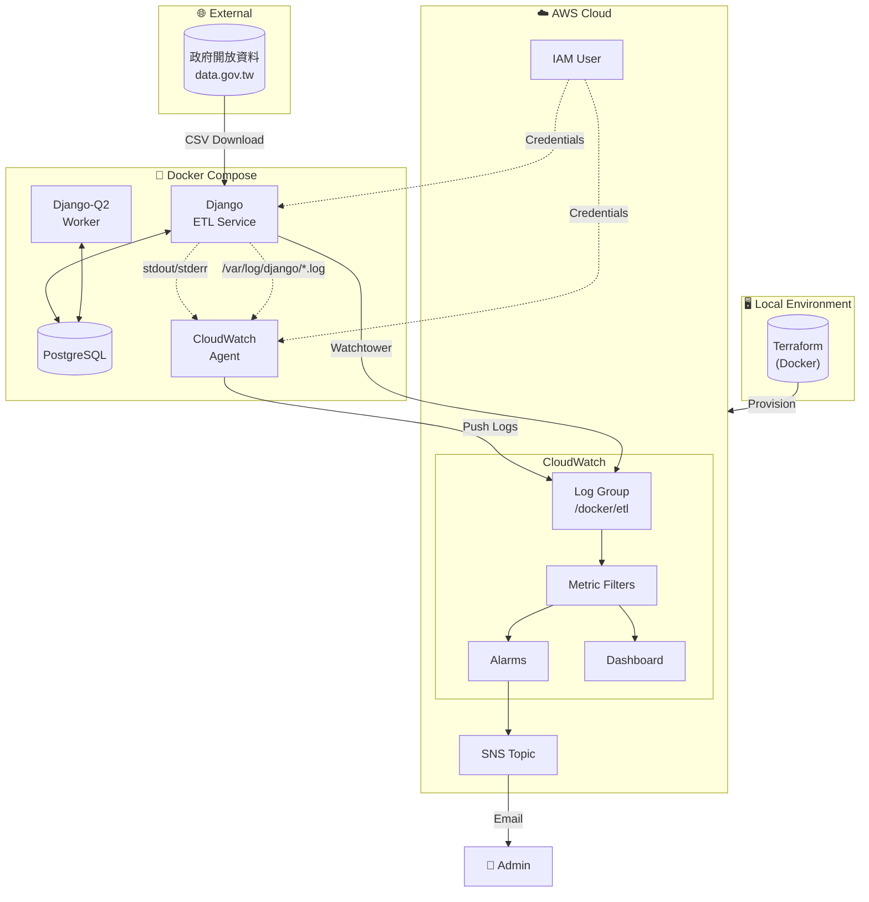

# 🏢 全國營業稅籍登記 ETL 系統

---

## 📋 目錄

- [專案概述](#-專案概述)
- [環境準備](#-環境準備)
- [快速開始](#-快速開始)
- [功能測試指南](#-功能測試指南)
- [題目一：數據資料收集](#-題目一數據資料收集)
- [題目二：數據應用服務](#-題目二數據應用服務)
- [題目三：Docker Log 蒐集 - IaC](#-題目三docker-log-蒐集---iac)
- [題目四：Docker Log 蒐集 - Log Implement](#-題目四docker-log-蒐集---log-implement)
- [資源清理](#-資源清理)
- [附錄](#-附錄)

---

## 🎯 專案概述

### 專案簡介

本專案為數據工程面試作業，實作一個完整的 ETL（Extract-Transform-Load）系統，從台灣政府開放資料平台擷取全國營業稅籍登記資料（約 304MB、160 萬筆），經過資料清洗與驗證後，批次匯入 PostgreSQL 資料庫。

系統採用容器化架構，透過 Docker Compose 編排多個服務，並使用 Terraform 實現基礎設施即代碼（IaC），自動化部署 AWS CloudWatch 監控資源。日誌收集採用雙路徑設計，同時支援 Console 輸出與實體檔案兩種收集方式。

### 技術棧

| 類別 | 技術 | 版本 | 用途 |
|------|------|------|------|
| **Backend** | Django | 6.0.1 | Web 框架、ETL 管理命令 |
| **Database** | PostgreSQL | 15 | 關聯式資料庫 |
| **Task Queue** | Django-Q2 | 1.9.0 | 背景任務排程 |
| **Data Processing** | pandas | 3.0.0 | CSV 讀取與資料清洗 |
| **Container** | Docker | 24+ | 容器化部署 |
| **Orchestration** | Docker Compose | 2.0+ | 多容器編排 |
| **IaC** | Terraform | 1.7 | AWS 基礎設施管理 |
| **Cloud** | AWS CloudWatch | - | 日誌收集、監控、告警 |
| **Logging** | Watchtower | 3.4.0 | CloudWatch 日誌整合 |
| **Logging** | python-json-logger | 4.0.0 | 結構化 JSON 日誌 |

### 系統架構總覽



---

## 🔧 環境準備

### 系統需求

| 軟體 | 最低版本 | 必要性 | 說明 |
|------|----------|--------|------|
| Docker | 24.0+ | ✅ 必要 | 容器運行環境 |
| Docker Compose | 2.0+ | ✅ 必要 | 多容器編排 |
| AWS CLI | 2.0+ | ✅ 必要 | AWS 憑證設定 |
| Git | 2.0+ | ✅ 必要 | 版本控制 |
| Poetry | 1.7+ | ⚪ 可選 | 本地開發用 |

### macOS 安裝

```bash
# 安裝 Homebrew（如果尚未安裝）
/bin/bash -c "$(curl -fsSL https://raw.githubusercontent.com/Homebrew/install/HEAD/install.sh)"

# 安裝 Docker Desktop（包含 Docker Compose）
brew install --cask docker

# 安裝 AWS CLI
brew install awscli

# 安裝 Git
brew install git

# （可選）安裝 Poetry - 本地開發用
brew install poetry

# 驗證安裝
docker --version
docker compose version
aws --version
git --version
```

> ⚠️ **注意**：安裝完 Docker Desktop 後，請確保已啟動應用程式。

### Windows 安裝

```powershell
# 使用 winget 安裝（Windows 11 內建，Windows 10 需另行安裝）

# 安裝 Docker Desktop
winget install Docker.DockerDesktop

# 安裝 AWS CLI
winget install Amazon.AWSCLI

# 安裝 Git
winget install Git.Git

# （可選）安裝 Poetry
winget install Python.Poetry

# 驗證安裝（重新開啟 PowerShell）
docker --version
docker compose version
aws --version
git --version
```

> ⚠️ **注意**：
> 1. Docker Desktop 需要啟用 WSL 2，安裝時會自動提示
> 2. 安裝完成後需重新啟動電腦
> 3. 首次啟動 Docker Desktop 需同意服務條款

### Linux (Ubuntu/Debian) 安裝

```bash
# 更新套件列表
sudo apt update

# 安裝 Docker
sudo apt install -y docker.io docker-compose-v2

# 將當前使用者加入 docker 群組（免 sudo）
sudo usermod -aG docker $USER
newgrp docker

# 安裝 AWS CLI
curl "https://awscli.amazonaws.com/awscli-exe-linux-x86_64.zip" -o "awscliv2.zip"
unzip awscliv2.zip
sudo ./aws/install
rm -rf aws awscliv2.zip

# 安裝 Git
sudo apt install -y git

# （可選）安裝 Poetry
curl -sSL https://install.python-poetry.org | python3 -

# 驗證安裝
docker --version
docker compose version
aws --version
git --version
```

### AWS IAM User 建立（Terraform 部署用）

Terraform 需要一個具有足夠權限的 IAM User 來建立 CloudWatch 相關資源。

#### 方法一：透過 AWS Console 建立

1. 登入 [AWS Console](https://console.aws.amazon.com/)
2. 前往 **IAM** → **Users** → **Create user**
3. 輸入使用者名稱：`terraform-deployer`
4. 選擇 **Attach policies directly**，附加以下政策：
   - `CloudWatchFullAccess`
   - `IAMFullAccess`
   - `AmazonSNSFullAccess`
5. 建立使用者後，前往點擊剛創立的使用者名稱 → **Create access key**
6. 選擇 **Command Line Interface (CLI)**
7. 記下 `Access Key ID` 和 `Secret Access Key`

#### 方法二：透過 AWS CLI 建立

```bash
# 建立 IAM User
aws iam create-user --user-name terraform-deployer

# 附加必要政策
aws iam attach-user-policy --user-name terraform-deployer \
    --policy-arn arn:aws:iam::aws:policy/CloudWatchFullAccess

aws iam attach-user-policy --user-name terraform-deployer \
    --policy-arn arn:aws:iam::aws:policy/IAMFullAccess

aws iam attach-user-policy --user-name terraform-deployer \
    --policy-arn arn:aws:iam::aws:policy/AmazonSNSFullAccess

# 建立 Access Key
aws iam create-access-key --user-name terraform-deployer
```

> 📝 **記下輸出的 `AccessKeyId` 和 `SecretAccessKey`，下一步會用到。**

---

## 🚀 快速開始

### Step 1：Clone 專案

```bash
git clone https://github.com/your-username/your-repo.git
cd your-repo
```

### Step 2：設定 Terraform AWS 憑證

編輯 `terraform/.env.aws` 檔案，填入你的 AWS 憑證：

```bash
# 複製範本
cp terraform/.env.aws terraform/.env

# 編輯設定
vim terraform/.env.aws  # 或使用任何編輯器
```

填入以下內容：

```env
# AWS 憑證（用於 Terraform 部署）
AWS_ACCESS_KEY_ID=你的-access-key-id
AWS_SECRET_ACCESS_KEY=你的-secret-access-key
AWS_DEFAULT_REGION=ap-northeast-1

# 告警通知信箱
TF_VAR_alarm_email=你的信箱@example.com
```

> ⚠️ **重要**：
> - 此檔案已加入 `.gitignore`，不會被提交到版本控制
> - `TF_VAR_alarm_email` 必須填寫，否則不會收到告警通知

### Step 3：執行 One-Click Setup

```bash
# 賦予執行權限
chmod +x run

# 執行一鍵部署
./run setup
```

這個指令會自動執行以下步驟：

| 步驟 | 說明 | 預估時間 |
|------|------|----------|
| 1 | Terraform Init & Apply | ~5-10 分鐘 |
| 2 | 取得 IAM User Credentials | ~5 秒 |
| 3 | 寫入 `.env.local` | ~1 秒 |
| 4 | 寫入 CloudWatch Agent Credentials | ~1 秒 |
| 5 | Docker Compose Build & Up | ~2-3 分鐘 |

成功後會看到：

```
==============================================
  環境已成功設定！
==============================================

📍 服務位置：
   - Django Admin: http://localhost:8000/admin
   - CloudWatch Dashboard: 請至 AWS Console 查看

📋 後續指令：
   ./run dry-run        # 測試 ETL（不實際寫入）
   ./run etl            # 執行完整 ETL
   ./run resume         # 執行任務斷點續傳
```

### Step 4：確認 SNS Email 訂閱

執行 `setup` 後，AWS SNS 會發送一封確認信到你設定的信箱。

1. 檢查你的信箱（包括垃圾郵件資料夾）
2. 找到來自 `AWS Notifications` 的郵件
3. 點擊 **Confirm subscription** 連結

```
📧 信件主旨：AWS Notification - Subscription Confirmation
📧 寄件者：no-reply@sns.amazonaws.com
```

> ⚠️ **重要**：如果不確認訂閱，將無法收到 CloudWatch 告警通知！

### Step 5：驗證部署成功

```bash
# 檢查所有容器是否正常運行
docker compose ps
```

預期輸出：

```
NAME                IMAGE                              STATUS
etl-django          your-repo-django                   Up (healthy)
etl-postgres        postgres:15-bullseye               Up (healthy)
q-worker            your-repo-django                   Up
cloudwatch-agent    amazon/cloudwatch-agent:latest     Up
```

```bash
# 檢查 Django Admin 是否可訪問
curl -I http://localhost:8000/admin/
```

預期輸出：

```
HTTP/1.1 302 Found
```

🎉 **恭喜！環境部署完成，可以開始測試了。**

---

<!-- 以下區塊待後續批次補充 -->

## 🧪 功能測試指南

> 📝 待補充

---

## 📊 題目一：數據資料收集

> 📝 待補充

---

## 🐳 題目二：數據應用服務

> 📝 待補充

---

## 🏗️ 題目三：Docker Log 蒐集 - IaC

> 📝 待補充

---

## 📝 題目四：Docker Log 蒐集 - Log Implement

> 📝 待補充

---

## 🧹 資源清理

> 📝 待補充

---

## 📚 附錄

> 📝 待補充
