# 🏢 全國營業稅籍登記 ETL 系統


## 🎯 專案概述

### 專案簡介

本專案為實作一個基本的 ETL（Extract-Transform-Load）系統，從台灣政府開放資料平台擷取全國營業稅籍登記資料（約 304MB、170 萬筆），經過資料清洗與驗證後，批次匯入 PostgreSQL 資料庫。

系統採用容器化架構，透過 Docker Compose 編排多個服務，並使用 Terraform 實現 IaC （Infrastructure as Code），自動化部署 AWS CloudWatch 監控資源。日誌收集採用雙路徑設計，同時支援 Console 輸出與實體檔案兩種收集方式。

###　Tech Stack

| 類別 | 技術 | 版本 | 用途 |
|------|------|------|------|
| **Backend** | Django | 6.0.1 | Web 框架、ETL 管理命令 |
| **Database** | PostgreSQL | 15 | 關聯式資料庫 |
| **Task Queue** | Django-Q2 | 1.9.0 | 背景任務排程 |
| **Data Processing** | pandas | 3.0.0 | CSV 讀取與資料清洗 |
| **Container** | Docker | 24+ | 容器化部署 |
| **Orchestration** | Docker Compose | 2.0+ | 多容器編排 |
| **IaC** | Terraform | 1.7 | AWS 基礎設施管理 |
| **Cloud** | AWS CloudWatch | - | 日誌收集、監控、告警 |
| **Logging** | Watchtower | 3.4.0 | CloudWatch 日誌整合 |
| **Logging** | python-json-logger | 4.0.0 | 結構化 JSON 日誌 |


---

## 🔧 環境準備

### 系統需求

| 軟體 | 最低版本 | 必要性 | 說明 |
|------|----------|--------|------|
| Docker | 24.0+ | ✅ 必要 | 容器運行環境 |
| Docker Compose | 2.0+ | ✅ 必要 | 多容器編排 |
| AWS CLI | 2.0+ | ✅ 必要 | AWS 憑證設定 |
| Git | 2.0+ | ✅ 必要 | 版本控制 |

### macOS 安裝

```bash
# 安裝 Homebrew（如果尚未安裝）
/bin/bash -c "$(curl -fsSL https://raw.githubusercontent.com/Homebrew/install/HEAD/install.sh)"

# 安裝 Docker Desktop（包含 Docker Compose）
brew install --cask docker

# 安裝 AWS CLI
brew install awscli

# 安裝 Git
brew install git

# （可選）安裝 Poetry - 本地開發用
brew install poetry

# 驗證安裝
docker --version
docker compose version
aws --version
git --version
```

> ⚠️ **注意**：安裝完 Docker Desktop 後，請確保已啟動應用程式。

### Windows 安裝（使用 WSL）

本專案建議 Windows 使用者透過 WSL (Windows Subsystem for Linux) 運行，可獲得與 Linux 一致的開發體驗。

#### 步驟一：安裝 WSL
```powershell
# 以系統管理員身分開啟 PowerShell，執行：
wsl --install

# 安裝完成後重新啟動電腦
```

> 💡 預設會安裝 Ubuntu，重啟後會自動開啟設定使用者名稱和密碼。

#### 步驟二：安裝 Docker Desktop 並啟用 WSL 整合

1. 下載並安裝 [Docker Desktop](https://docs.docker.com/desktop/)
2. 安裝時勾選 **Use WSL 2 instead of Hyper-V**
3. 安裝完成後，重新啟動
4. 啟動 Docker Desktop，首次啟動需同意服務條款

#### 步驟三：在 WSL 中安裝相依套件
```bash
# 開啟 WSL 終端機（在開始選單搜尋 "Ubuntu" 或Command Prompt 執行 `wsl`）

# 更新套件列表
sudo apt update && sudo apt upgrade -y

# 安裝 Git
sudo apt install -y git

# 安裝 AWS CLI
sudo snap install aws-cli --classic


# 驗證安裝
docker --version          # 應顯示 Docker Desktop 版本
docker compose version
aws --version
git --version
```

> ⚠️ **注意**：
> 1. 所有後續操作請在 **WSL 終端機** 中執行，而非 PowerShell 或 CMD
> 2. 專案資料夾建議放在 WSL 檔案系統內（如 `~/projects/`），而非 Windows 路徑（如 `/mnt/c/`），以獲得更好的效能
> 3. 若 `docker` 命令無法執行，請確認 Docker Desktop 已啟動且 WSL Integration 已啟用
```


### Linux (Ubuntu/Debian) 安裝

```bash
# 更新套件列表
sudo apt update

# 安裝 Docker
sudo apt install -y docker.io docker-compose-v2

# 將當前使用者加入 docker 群組（免 sudo）
sudo usermod -aG docker $USER
newgrp docker

# 安裝 AWS CLI
curl "https://awscli.amazonaws.com/awscli-exe-linux-x86_64.zip" -o "awscliv2.zip"
unzip awscliv2.zip
sudo ./aws/install
rm -rf aws awscliv2.zip

# 安裝 Git
sudo apt install -y git


# 驗證安裝
docker --version
docker compose version
aws --version
git --version
```

### AWS IAM User 建立（Terraform 部署用）

Terraform 需要一個具有足夠權限的 IAM User 來建立 CloudWatch 相關資源。

#### 方法一：透過 AWS Console 建立

1. 登入 AWS Console
2. 前往 **IAM** → **Users** → **Create user**
3. 輸入使用者名稱：`terraform-deployer`
4. 選擇 **Attach policies directly**，附加以下政策：
   - `CloudWatchFullAccess`
   - `IAMFullAccess`
   - `AmazonSNSFullAccess`
5. 建立使用者後，前往點擊剛創立的使用者名稱 → **Create access key**
6. 選擇 **Command Line Interface (CLI)**
7. 記下 `Access Key ID` 和 `Secret Access Key`

#### 方法二：透過 AWS CLI 建立

```bash
# 建立 IAM User
aws iam create-user --user-name terraform-deployer

# 附加必要政策
aws iam attach-user-policy --user-name terraform-deployer \
    --policy-arn arn:aws:iam::aws:policy/CloudWatchFullAccess

aws iam attach-user-policy --user-name terraform-deployer \
    --policy-arn arn:aws:iam::aws:policy/IAMFullAccess

aws iam attach-user-policy --user-name terraform-deployer \
    --policy-arn arn:aws:iam::aws:policy/AmazonSNSFullAccess

# 建立 Access Key
aws iam create-access-key --user-name terraform-deployer
```

> 📝 **記下輸出的 `AccessKeyId` 和 `SecretAccessKey`，下一步會用到。**

---

## 🚀 快速開始

### Step 1：Clone 專案

```bash
git clone https://github.com/wrbyepct/assignment.git
cd assignment
```

### Step 2：設定 Terraform AWS 憑證

編輯 `terraform/.env.aws` 檔案，填入你的 AWS 憑證：

```bash
# 複製範本
cp terraform/.env.aws terraform/.env

# 編輯設定
vim terraform/.env.aws  # 或使用任何編輯器
```

填入以下內容：

```env
# AWS 憑證（用於 Terraform 部署）
AWS_ACCESS_KEY_ID=你的-access-key-id
AWS_SECRET_ACCESS_KEY=你的-secret-access-key
AWS_DEFAULT_REGION=ap-northeast-1

# 告警通知信箱
TF_VAR_alarm_email=你的信箱@example.com
```

> ⚠️ **重要**：
> - 此檔案已加入 `.gitignore`，不會被提交到版本控制
> - `TF_VAR_alarm_email` 必須填寫，否則不會收到告警通知

### Step 3：執行 One-Click Setup

```bash
# 賦予執行權限
chmod +x run

# 執行一鍵部署
./run setup
```

這個指令會自動執行以下步驟：

| 步驟 | 說明 | 預估時間 |
|------|------|----------|
| 1 | Terraform Init & Apply | ~5-10 分鐘 |
| 2 | 取得 IAM User Credentials | ~5 秒 |
| 3 | 寫入 `.env.local` | ~1 秒 |
| 4 | 寫入 CloudWatch Agent Credentials | ~1 秒 |
| 5 | Docker Compose Build & Up | ~2-3 分鐘 |

成功後會看到：

```
==============================================
  環境已成功設定！
==============================================

📍 服務位置：
   - Django Admin: http://localhost:8000/admin
   - CloudWatch Dashboard: 請至 AWS Console 查看

📋 後續指令：
   ./run dry-run        # 測試 ETL（不實際寫入）
   ./run etl            # 執行完整 ETL
   ./run resume         # 執行任務斷點續傳
```

### Step 4：確認 SNS Email 訂閱

執行 `setup` 後，AWS SNS 會發送一封確認信到你設定的信箱。

1. 檢查你的信箱（包括垃圾郵件資料夾）
2. 找到來自 `AWS Notifications` 的郵件
3. 點擊 **Confirm subscription** 連結

```
📧 信件主旨：AWS Notification - Subscription Confirmation
📧 寄件者：no-reply@sns.amazonaws.com
```

> ⚠️ **重要**：如果不確認訂閱，將無法收到 CloudWatch 告警通知！

### Step 5：驗證部署成功

```bash
# 檢查所有容器是否正常運行
docker compose ps
```

預期輸出：

```
NAME                IMAGE                              STATUS
etl-django          your-repo-django                   Up (healthy)
etl-postgres        postgres:15-bullseye               Up (healthy)
q-worker            your-repo-django                   Up
cloudwatch-agent    amazon/cloudwatch-agent:latest     Up
```

```bash
# 檢查 Django Admin 是否可訪問
curl -I http://localhost:8000/admin/
```

預期輸出：

```
HTTP/1.1 302 Found
```

---


## 📋 目錄

- [一、專案概述與架構決策](#一專案概述與架構決策)
- [二、題目一：數據資料收集 - ETL Pipeline](#二題目一數據資料收集---etl-pipeline)
- [三、題目二：數據應用服務 - 容器化與排程](#三題目二數據應用服務---容器化與排程)
- [四、題目三：Docker Log 蒐集 - IaC](#四題目三docker-log-蒐集---iac)
- [五、題目四：Docker Log 蒐集 - Log Implement](#五題目四docker-log-蒐集---log-implement)
- [附錄：完整測試 Checklist](#附錄完整測試-checklist)

---

## 一、專案挑戰與架構決策

### 1.1 題目挑戰分析

這份資料有幾個技術挑戰：

| 挑戰面向 | 具體數據 | 為什麼這是個挑戰？ |
|----------|----------|-------------------|
| **資料規模** | 304MB CSV、約 170 萬筆 | 一次載入占用較多記憶體 |
| **資料品質** | 可能混合空值、重複資料 | 需要完善的驗證與清洗邏輯 |
| **效能要求** | 完整匯入需在合理時間內完成 | 傳統 ORM 逐筆寫入會耗費大量時間 |
| **容錯需求** | 單筆錯誤不應中斷整體流程 | 需要斷點續傳與錯誤追溯機制 |

**我給自己設定的成功指標**：
- ✅ 完整匯入 170 萬筆資料在 15 分鐘內完成，並且資料符合格式
- ✅ 可斷點續傳，中斷後可從上次進度繼續(Bonus)
- ✅ 有錯誤可追溯，有執行歷史記錄(Bonus)

---

### 1.2 架構決策記錄

#### 為什麼選擇 PostgreSQL 而非 NoSQL？

在開始寫 code 之前，我花了一些時間思考資料庫選型。雖然 MongoDB 等 NoSQL 資料庫在處理大量寫入時也有不錯的表現，但考量到這份資料的特性，我選擇了 PostgreSQL：

| 考量點 | PostgreSQL | NoSQL（如 MongoDB） |
|--------|------------|---------------------|
| **資料結構** | ✅ 營業登記資料結構固定，17 個欄位明確定義 | 較適合 Schema 經常變動的場景 |
| **查詢需求** | ✅ 未來可能需要關聯查詢（公司 → 行業） | 適合單一文件查詢 |


---

### 1.3 系統架構總覽

整個系統從本地開發到雲端監控，分為三個層次：

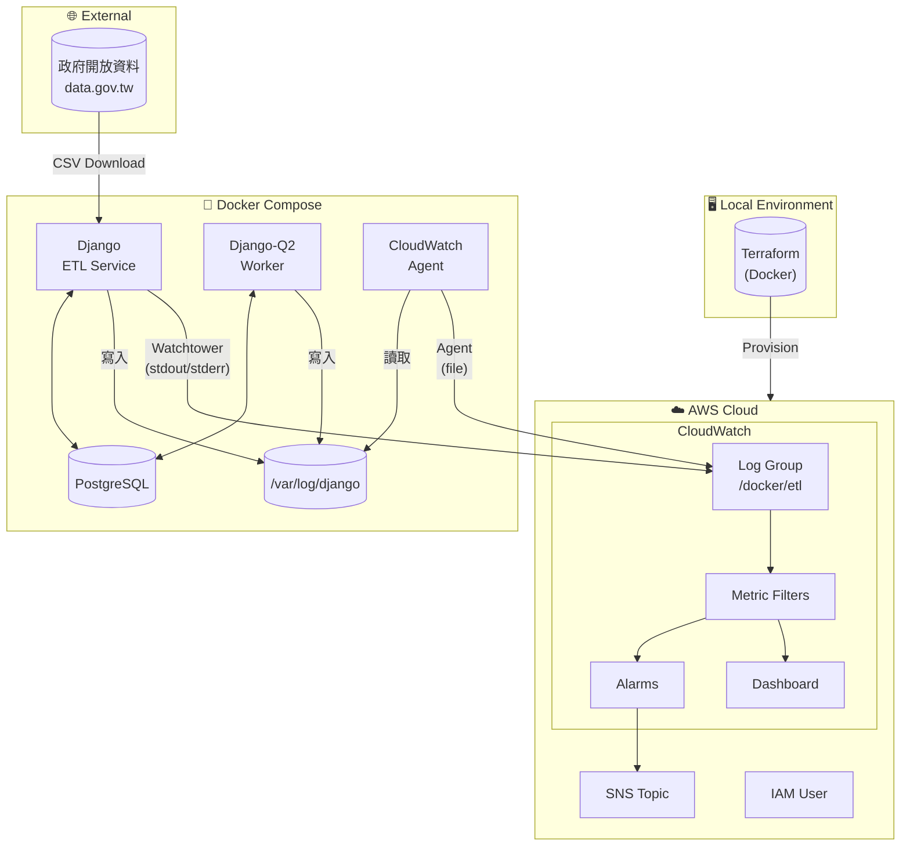
```mermaid
flowchart TB
    subgraph Local["🖥️ Local Environment"]
        TF[("Terraform<br/>(Docker)")]
    end

    subgraph Docker["🐳 Docker Compose"]
        DJ[Django<br/>ETL Service]
        PG[(PostgreSQL)]
        QW[Django-Q2<br/>Worker]
        CWA[CloudWatch<br/>Agent]
        LOG_VOL[("/var/log/django")]
        
        DJ <--> PG
        QW <--> PG
        DJ -->|寫入| LOG_VOL
        QW -->|寫入| LOG_VOL
        CWA -->|讀取| LOG_VOL
    end

    subgraph AWS["☁️ AWS Cloud"]
        subgraph CW["CloudWatch"]
            LG[Log Group<br/>/docker/etl]
            MF[Metric Filters]
            AL[Alarms]
            DB[Dashboard]
        end
        SNS[SNS Topic]
        IAM[IAM User]
    end

    subgraph External["🌐 External"]
        GOV[("政府開放資料<br/>data.gov.tw")]
    end

    GOV -->|CSV Download| DJ
    TF -->|Provision| AWS
    DJ -->|"Watchtower<br/>(stdout/stderr)"| LG
    CWA -->|"Agent<br/>(file)"| LG
    LG --> MF --> AL --> SNS
    MF --> DB
```

---

### 1.4 快速驗證資料結構

在設計 Table 之前先簡單驗證資料長什麼樣子：

```bash
# 啟動 docker 服務後，進入 Django Shell
./run django-shell

>>> import pandas as pd
>>> url = "https://eip.fia.gov.tw/data/BGMOPEN1.csv"
>>> df = pd.read_csv(url, nrows=5, encoding='utf-8')
>>> print(df.columns.tolist())

Output: 
['營業地址', '統一編號', '總機構統一編號', '營業人名稱', '資本額', '設立日期', '組織別名稱', '使用統一發票', '行業代號', '名稱', '行業代號1', '名稱1', '行業代號2', '名稱2', '行業代號3', '名稱3']
```

這份資料包含以下欄位：
- **基本資訊**：統一編號、總機構統一編號、營業人名稱、營業地址
- **登記資訊**：資本額、設立日期、組織別名稱、使用統一發票
- **行業資訊**：行業代號（主要）、名稱、行業代號1-3、名稱1-3

---

### 1.5 資料模型設計

根據資料特性，我設計了以下 Model 結構：


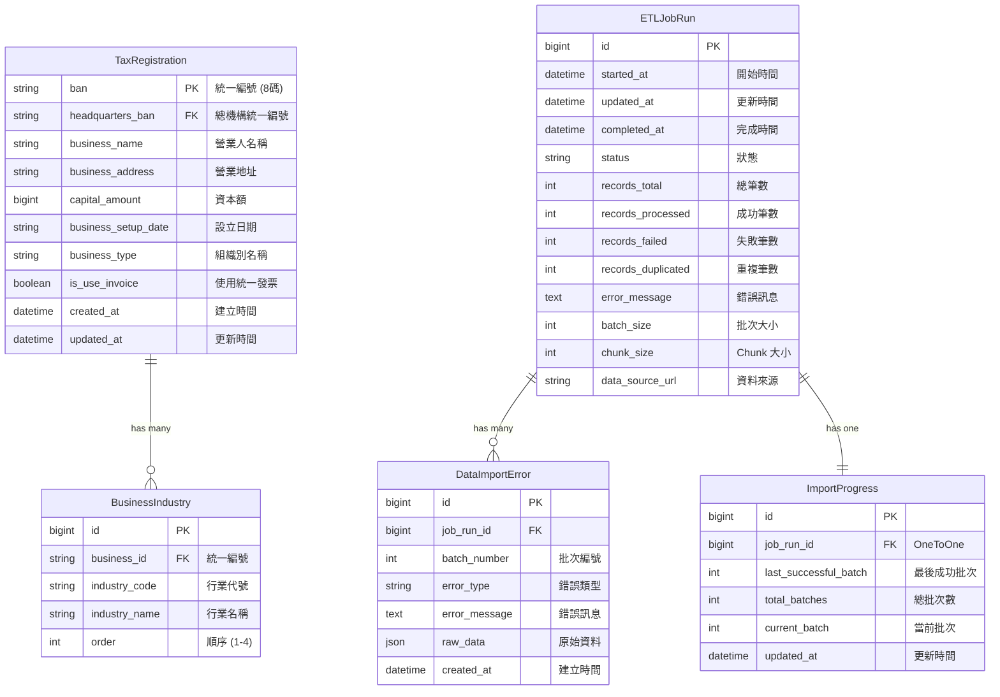
```mermaid
erDiagram
    %% ===== 業務資料模型 =====
    TaxRegistration ||--o{ BusinessIndustry : "has many"
    
    TaxRegistration {
        string ban PK "統一編號 (8碼)"
        string headquarters_ban FK "總機構統一編號"
        string business_name "營業人名稱"
        string business_address "營業地址"
        bigint capital_amount "資本額"
        string business_setup_date "設立日期"
        string business_type "組織別名稱"
        boolean is_use_invoice "使用統一發票"
        datetime created_at "建立時間"
        datetime updated_at "更新時間"
    }
    
    BusinessIndustry {
        bigint id PK
        string business_id FK "統一編號"
        string industry_code "行業代號"
        string industry_name "行業名稱"
        int order "順序 (1-4)"
    }

    %% ===== ETL 追蹤模型 =====
    ETLJobRun ||--o{ DataImportError : "has many"
    ETLJobRun ||--|| ImportProgress : "has one"
    
    ETLJobRun {
        bigint id PK
        datetime started_at "開始時間"
        datetime updated_at "更新時間"
        datetime completed_at "完成時間"
        string status "狀態"
        int records_total "總筆數"
        int records_processed "成功筆數"
        int records_failed "失敗筆數"
        int records_duplicated "重複筆數"
        text error_message "錯誤訊息"
        int batch_size "批次大小"
        int chunk_size "Chunk 大小"
        string data_source_url "資料來源"
    }
    
    DataImportError {
        bigint id PK
        bigint job_run_id FK
        int batch_number "批次編號"
        string error_type "錯誤類型"
        text error_message "錯誤訊息"
        json raw_data "原始資料"
        datetime created_at "建立時間"
    }
    
    ImportProgress {
        bigint id PK
        bigint job_run_id FK "OneToOne"
        int last_successful_batch "最後成功批次"
        int total_batches "總批次數"
        int current_batch "當前批次"
        datetime updated_at "更新時間"
    }
```

#### 模型設計的幾個考量

| 設計決策 | 為什麼這樣做？ |
|----------|---------------|
| **BusinessIndustry 獨立成表** | 獨立成表便於查詢「所有從事某行業的公司」，未來若有新增也方便添加　|
| **ETLJobRun 追蹤每次執行** | 便於問題排查，可以知道「昨天那次 ETL 處理了多少筆、失敗了幾筆」 |
| **ImportProgress 獨立於 ETLJobRun** | 職責分離，任務頻繁更新不需動到 ETLJobRun
| **DataImportError 記錄原始資料** | 錯誤資料以 JSON 保存，便於人為檢視與後續修正 |

---

## 二、題目一：數據資料收集 - ETL Pipeline

### 2.1 ETL 整體流程圖

整個 ETL 流程採用經典的三階段架構，但加入了「Tracker」作為追蹤機制：

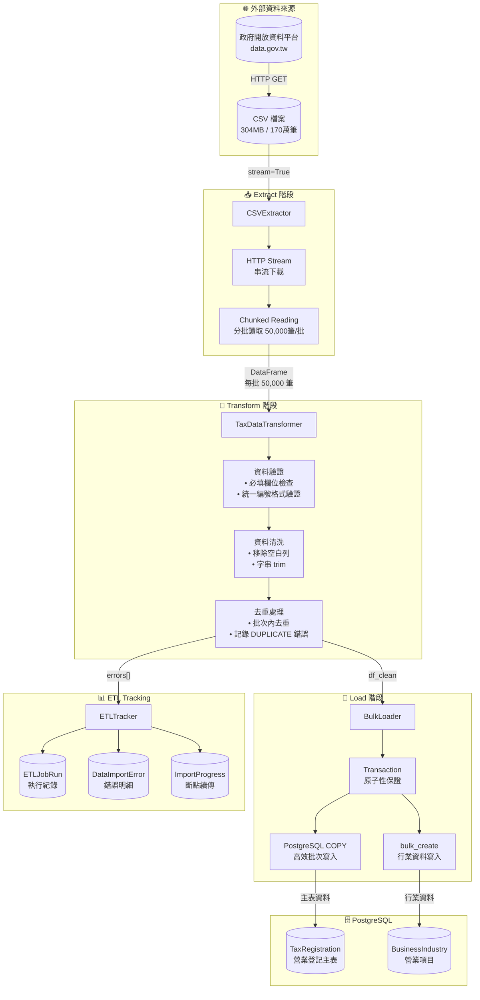
```mermaid
flowchart TB
    subgraph External["🌐 外部資料來源"]
        GOV[("政府開放資料平台<br/>data.gov.tw")]
        CSV[("CSV 檔案<br/>304MB / 170萬筆")]
    end

    subgraph Extract["📥 Extract 階段"]
        EXT[CSVExtractor]
        STREAM["HTTP Stream<br/>串流下載"]
        CHUNK["Chunked Reading<br/>分批讀取 50,000筆/批"]
    end

    subgraph Transform["🔄 Transform 階段"]
        TRANS[TaxDataTransformer]
        VALID["資料驗證<br/>• 必填欄位檢查<br/>• 統一編號格式驗證"]
        CLEAN["資料清洗<br/>• 移除空白列<br/>• 字串 trim"]
        DEDUP["去重處理<br/>• 批次內去重<br/>• 記錄 DUPLICATE 錯誤"]
    end

    subgraph Load["💾 Load 階段"]
        LOADER[BulkLoader]
        COPY["PostgreSQL COPY<br/>高效批次寫入"]
        BULK["bulk_create<br/>行業資料寫入"]
        TXN["Transaction<br/>原子性保證"]
    end

    subgraph Database["🗄️ PostgreSQL"]
        TAX[(TaxRegistration<br/>營業登記主表)]
        IND[(BusinessIndustry<br/>營業項目)]
    end

    subgraph Tracking["📊 ETL Tracking"]
        TRACKER[ETLTracker]
        JOB[(ETLJobRun<br/>執行紀錄)]
        ERR[(DataImportError<br/>錯誤明細)]
        PROG[(ImportProgress<br/>斷點續傳)]
    end

    GOV -->|"HTTP GET"| CSV
    CSV -->|"stream=True"| EXT
    EXT --> STREAM --> CHUNK
    
    CHUNK -->|"DataFrame<br/>每批 50,000 筆"| TRANS
    TRANS --> VALID --> CLEAN --> DEDUP
    
    DEDUP -->|"df_clean"| LOADER
    DEDUP -->|"errors[]"| TRACKER
    
    LOADER --> TXN
    TXN --> COPY -->|"主表資料"| TAX
    TXN --> BULK -->|"行業資料"| IND
    
    TRACKER --> JOB
    TRACKER --> ERR
    TRACKER --> PROG

```

---

### 2.2 Extract 階段

#### 技術選型

| 工具 | 選擇理由 |
|------|----------|
| **requests + stream** | 串流下載避免 304MB 一次載入記憶體 |
| **urllib3 Retry** | 指數退避重試，處理網路不穩定 |
| **pandas chunksize** | Generator 方式分批讀取，控制記憶體用量 |


#### 下載策略

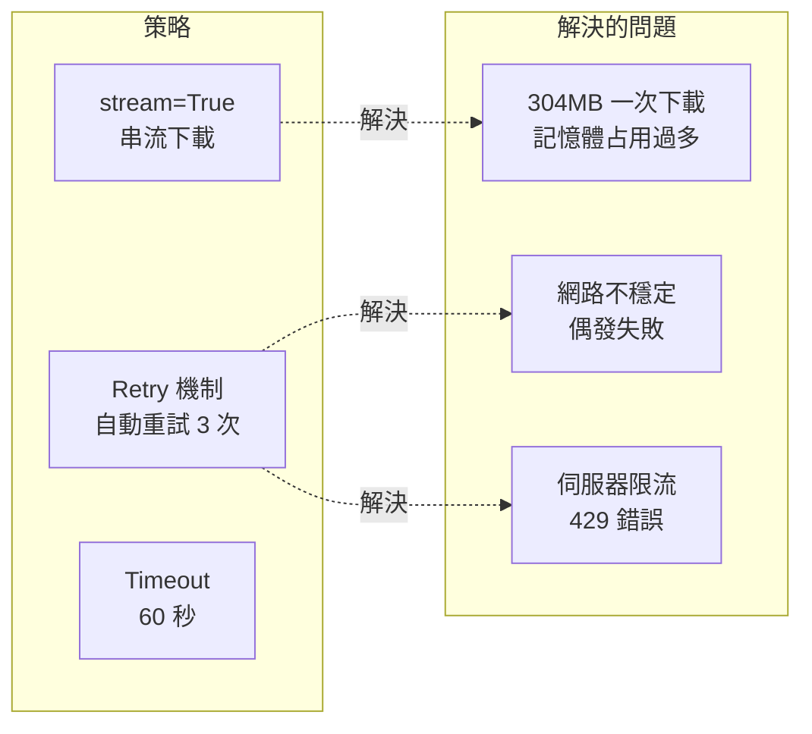
```mermaid
flowchart LR
    subgraph 策略
        STREAM["stream=True<br/>串流下載"]
        RETRY["Retry 機制<br/>自動重試 3 次"]
        TIMEOUT["Timeout<br/>60 秒"]
    end

    subgraph 解決的問題
        P1["304MB 一次下載<br/>記憶體占用過多"]
        P2["網路不穩定<br/>偶發失敗"]
        P3["伺服器限流<br/>429 錯誤"]
    end

    STREAM -.->|解決| P1
    RETRY -.->|解決| P2
    RETRY -.->|解決| P3
```

**Retry 設定說明**：

| 設定 | 值 | 說明 |
|------|-----|------|
| total | 3 | 最多重試 3 次 |
| backoff_factor | 1 | 重試間隔：1s → 2s → 4s |
| status_forcelist | 429, 500, 502, 503, 504 | 遇到這些狀態碼才重試 |

#### 分批處理設計

| 設計 | 值 | 說明 |
|------|-----|------|
| **Chunk Size** | 50,000 筆/批 | 可透過 `--chunk-size` 參數調整 |
| **批次數量** | 約 34 批 | 170 萬 ÷ 5 萬 |


> ⚠️ Production 環境會再根據記憶體與資料特性進行效能測試後調整

---

### 2.3 Transform 階段

#### 資料驗證規則

| 規則 | 處理方式 | 錯誤類型 |
|------|----------|----------|
| 空白列 | 移除整列 | - |
| 必填欄位 | 統一編號、營業人名稱必須存在 | 中斷任務執行 |
| 統一編號格式 | 必須為 8 位數字 | `INVALID_BAN` |
| 批次內重複 | 保留第一筆，其餘標記錯誤 | `DUPLICATE` |


#### 驗證流程

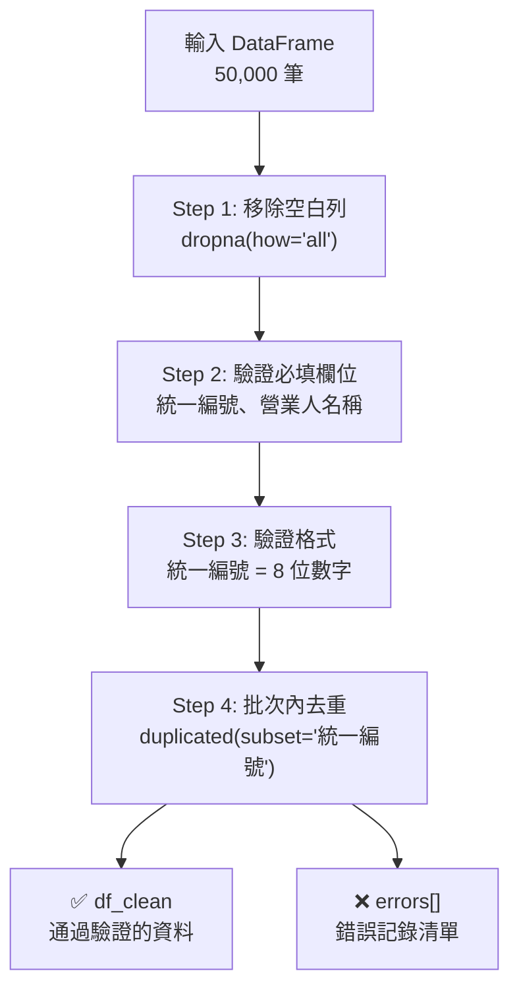
```mermaid
flowchart TB
    INPUT["輸入 DataFrame<br/>50,000 筆"]
    
    STEP1["Step 1: 移除空白列<br/>dropna(how='all')"]
    STEP2["Step 2: 驗證必填欄位<br/>統一編號、營業人名稱"]
    STEP3["Step 3: 驗證格式<br/>統一編號 = 8 位數字"]
    STEP4["Step 4: 批次內去重<br/>duplicated(subset='統一編號')"]
    
    OUTPUT_CLEAN["✅ df_clean<br/>通過驗證的資料"]
    OUTPUT_ERR["❌ errors[]<br/>錯誤記錄清單"]
    
    INPUT --> STEP1 --> STEP2 --> STEP3 --> STEP4
    STEP4 --> OUTPUT_CLEAN
    STEP4 --> OUTPUT_ERR
    
```

#### 錯誤處理策略：「記錄並繼續」

| 錯誤層級 | 處理方式 |
|----------|----------|
| **單筆錯誤** | 記錄到 `DataImportError`，該批次其餘資料繼續處理 |
| **整批失敗** | 匯出原始資料到 CSV 檔案，詢問是否繼續下一批 |


> 💡 搭配告警機制，當錯誤率超過 threshold 時通知人工介入，但不阻擋其餘正常資料的處理

---

### 2.4 Load 階段

#### 寫入策略

這是我在這個專案中學到的其中一個新技術，一開始我只知道 Django ORM 的 `bulk_create`，170 萬筆資料要跑很久。後來才發現有 PostgreSQL COPY，時間效率大幅提升：

| 資料類型 | 方法 | 理由 |
|----------|------|------|
| **主表 TaxRegistration** | PostgreSQL COPY | 170 萬筆，效能優先（比 ORM 快 10-100 倍） |
| **行業表 BusinessIndustry** | bulk_create | 資料量較小，且需要處理重複資料 |


#### Transaction 設計

| 設計 | 說明 |
|------|------|
| **範圍** | 每批次一個 Transaction |
| **內容** | 稅籍表 + 行業表在同一 Transaction |
| **失敗處理** | 整批 Rollback，保證資料一致性 |

---

### 2.5 Tracker 機制 (Bonus)

#### 為什麼需要 Tracker？


| 目的 | 說明 |
|------|------|
| **可觀測性** | 追蹤執行狀態（running / success / failed） |
| **統計數據** | 總筆數、成功、失敗、重複 |
| **斷點續傳** | 記錄 `last_successful_batch`，中斷後可從此繼續 |
| **錯誤追溯** | `DataImportError` 保存每筆錯誤的原始資料 |

#### 斷點續傳流程

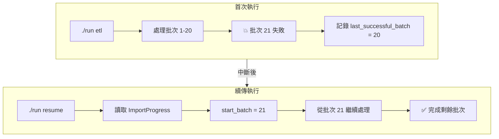
```mermaid
flowchart TB
    subgraph 首次執行
        A1["./run etl"] --> A2["處理批次 1-20"]
        A2 --> A3["💥 批次 21 失敗"]
        A3 --> A4["記錄 last_successful_batch = 20"]
    end
    
    subgraph 續傳執行
        B1["./run resume"] --> B2["讀取 ImportProgress"]
        B2 --> B3["start_batch = 21"]
        B3 --> B4["從批次 21 繼續處理"]
        B4 --> B5["✅ 完成剩餘批次"]
    end
    
    首次執行 -->|"中斷後"| 續傳執行
    
```

#### ImportProgress 設計

| 欄位 | 用途 |
|------|------|
| `last_successful_batch` | 斷點續傳的依據 |
| `current_batch` | 即時監控目前處理到哪一批 |


#### 狀態流轉

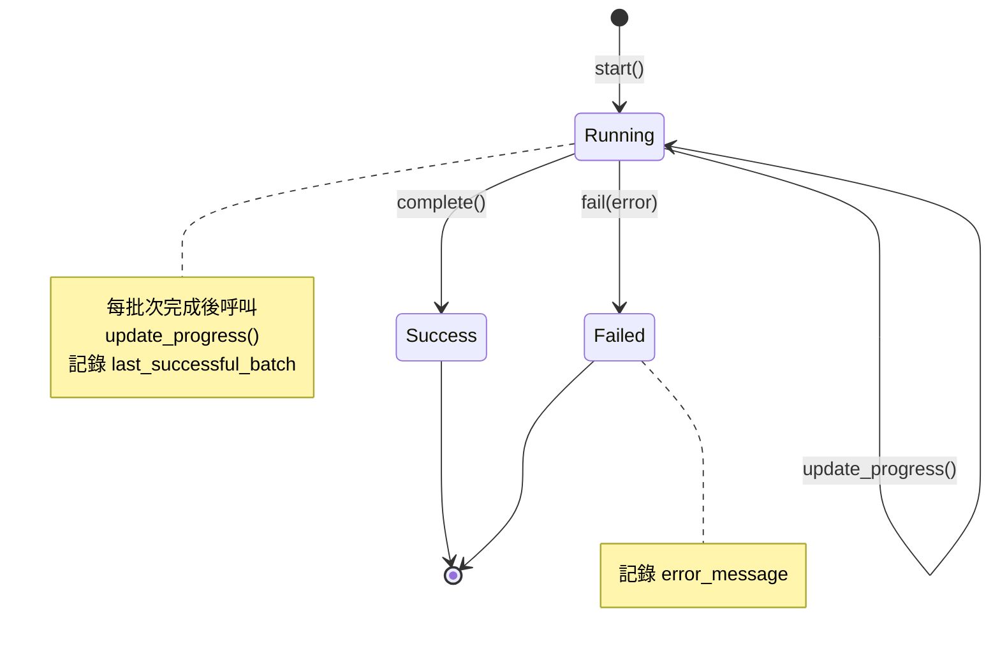
```mermaid
stateDiagram-v2
    [*] --> Running: start()
    
    Running --> Success: complete()
    Running --> Failed: fail(error)
    Running --> Running: update_progress()
    
    Success --> [*]
    Failed --> [*]
    
    note right of Running
        每批次完成後呼叫
        update_progress()
        記錄 last_successful_batch
    end note
    
    note right of Failed
        記錄 error_message

    end note
```

---

### 2.6 執行指令與測試

---

### ETL Dry Run 測試

Dry Run 模式會執行完整的資料擷取與驗證流程，但**不會實際寫入資料庫**，適合用於測試資料品質和 ETL 邏輯。

```bash
./run dry-run
```

**預期輸出：**

```
📥 階段 1: 擷取資料...
🔄 階段 2: 轉換並載入資料...

📦 批次 1
  原始筆數: 50,000
  清理: 50,000 → 49,876 筆
  🔍 DRY RUN: 將匯入 49,876 筆

📦 批次 2
  原始筆數: 50,000
  ...

============================================================
執行摘要
============================================================
執行 ID:      1
狀態:         成功
執行時間:     45.23 秒

處理統計:
  總筆數:     100,000
  ✅ 成功:    0 (0.00%)        # Dry Run 不實際寫入
  ❌ 失敗:    124
  🔄 重複:    0
```

**驗證重點：**
- ✅ 資料成功從政府開放資料平台下載
- ✅ 資料清理邏輯正確執行
- ✅ 顯示 `DRY RUN` 提示，未實際寫入
- ✅ 錯誤筆數統計正確

---

### ETL 完整匯入（Truncate）

執行完整的 ETL 流程，會**清空現有資料**後重新匯入全部資料。

```bash
./run etl
```

系統會提示確認：

```
⚠️  執行全量覆蓋: 即將刪除 0 筆營業登記資料!
確定要繼續嗎? (yes/no): yes
```

**預期輸出：**

```
🗑️  清空資料表...
  ✅ 完成

============================================================
開始執行 ETL (ID: 2)
============================================================

📥 階段 1: 擷取資料...
🔄 階段 2: 轉換並載入資料...

📦 批次 1
  原始筆數: 50,000
  清理: 50,000 → 49,876 筆
  ✅ 成功匯入: 49,876 筆

...（約 48 個批次）...

============================================================
執行摘要
============================================================
執行 ID:      2
狀態:         成功
執行時間:     312.45 秒

處理統計:
  總筆數:     2,400,000
  ✅ 成功:    2,398,234 (99.93%)
  ❌ 失敗:    1,766
  🔄 重複:    0
```
#### 驗證資料匯入結果

```bash
# 進入 Django Shell 查詢資料筆數
./run django-shell

>>> from core.tax_registration.models import TaxRegistration, BusinessIndustry
>>> TaxRegistration.objects.count()
# 預期：約 1,700,000

>>> BusinessIndustry.objects.count()
# 預期：約 4,000,000（每家公司平均 2-3 個行業）
```

---

### ETL 斷點續傳（Resume）

測試 ETL 中斷後從上次成功的批次繼續執行。

#### 模擬中斷場景

1. 執行 ETL 並在過程中手動中斷（Ctrl+C）：

```bash
./run etl --auto

# 等待執行到第 10 批次左右，按 Ctrl+C 中斷
```

2. 檢查進度記錄：

```bash
./run django-shell

>>> from core.tax_registration.models import ImportProgress, ETLJobRun
>>> job = ETLJobRun.objects.latest('started_at')
>>> job.status
'running'  # 因為被中斷，狀態還是 running

>>> progress = ImportProgress.objects.get(job_run=job)
>>> progress.last_successful_batch
10  # 最後成功的批次
```

3. 執行斷點續傳：

```bash
# 等五分鐘後跑斷點續傳(測試用心跳時間)
./run resume
```

**預期輸出：**

```
  ⏩ 從批次 11 繼續...

============================================================
開始執行 ETL (ID: 4)
============================================================


📥 階段 1: 擷取資料...
🔄 階段 2: 轉換並載入資料...

📦 批次 11
  原始筆數: 50,000
  ...
```


---

## 三、題目二：數據應用服務 - 容器化與排程

### 3.1 容器化設計

#### 容器架構圖

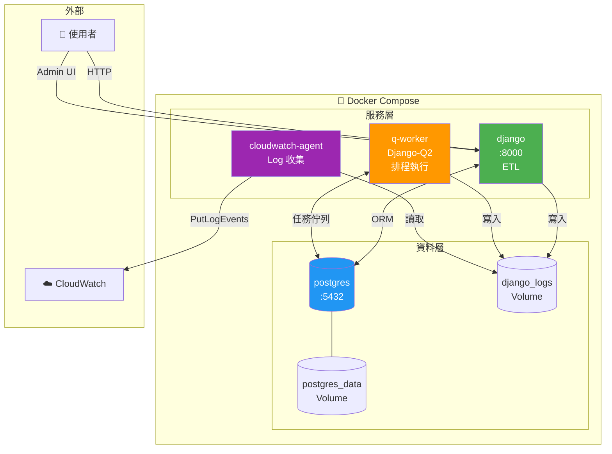
```mermaid
flowchart TB
    subgraph DockerCompose["🐳 Docker Compose"]
        subgraph Services["服務層"]
            DJ["django<br/>:8000<br/>ETL"]
            QW["q-worker<br/>Django-Q2<br/>排程執行"]
            CWA["cloudwatch-agent<br/>Log 收集"]
        end
        
        subgraph Data["資料層"]
            PG[("postgres<br/>:5432")]
            VOL_DB[("postgres_data<br/>Volume")]
            VOL_LOG[("django_logs<br/>Volume")]
        end
        
        DJ <-->|ORM| PG
        QW <-->|任務佇列| PG
        PG --- VOL_DB
        
        DJ -->|寫入| VOL_LOG
        QW -->|寫入| VOL_LOG
        CWA -->|讀取| VOL_LOG
    end
    
    subgraph External["外部"]
        USER[👤 使用者]
        AWS[☁️ CloudWatch]
    end
    
    USER -->|HTTP| DJ
    USER -->|Admin UI| DJ
    CWA -->|PutLogEvents| AWS

    style DJ fill:#4caf50,color:#fff
    style QW fill:#ff9800,color:#fff
    style PG fill:#2196f3,color:#fff
    style CWA fill:#9c27b0,color:#fff
```

#### 設計原則

| 原則 | 實踐 |
|------|------|
| **單一職責** | 每個 Container 只做一件事 |
| **服務依賴** | `depends_on` + `healthcheck` 確保啟動順序 |
| **非 Root 執行** | 使用 `django` 用戶，提升安全性 |
| **Volume 持久化** | 資料庫 + Log 使用 Named Volume |


#### Dockerfile 最佳化

| 技術 | 效果 |
|------|------|
| **Multi-stage Build** | 最終 Image 不含編譯工具（gcc），體積減少約 200MB |
| **Non-root User** | 以 `django` 用戶執行，避免容器逃逸風險 |
| **PYTHONUNBUFFERED=1** | Log 即時輸出，不經緩衝區 |
| **Healthcheck** | 確保服務真正可用後才接受流量 |

#### Volume 設計

| Volume | 掛載點 | 用途 |
|--------|--------|------|
| `postgres_data` | `/var/lib/postgresql/data` | 資料庫持久化 |
| `django_logs` | `/var/log/django` | Django 與 Q-Worker 共享 Log 目錄 |

`django_logs` 被三個服務共用，這是刻意的設計：
- **django**：寫入 Log
- **q-worker**：寫入 Log
- **cloudwatch-agent**：讀取 Log 並推送至 AWS

---

### 3.2 排程策略

#### 技術選型比較

在選擇排程方案時，我評估了三個選項：

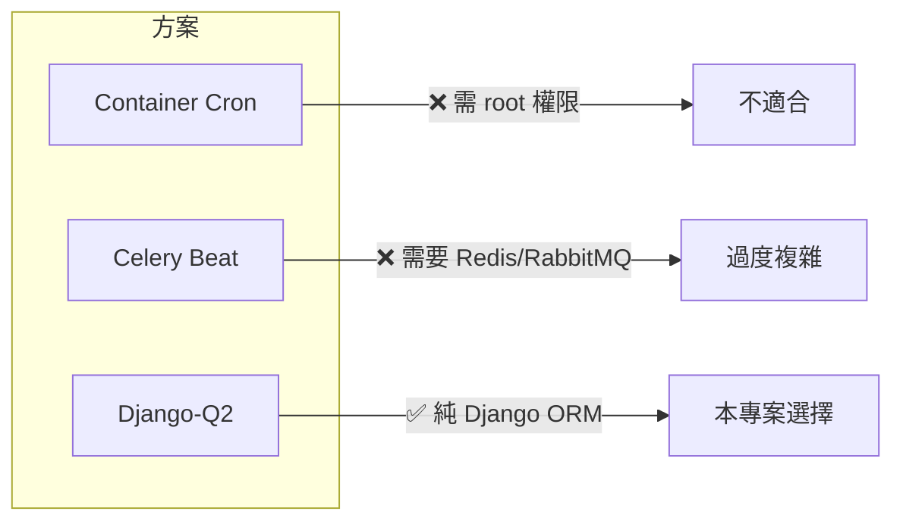
```mermaid
flowchart LR
    subgraph 方案
        A["Container Cron"]
        B["Celery Beat"]
        C["Django-Q2"]
    end
    
    A -->|"❌ 需 root 權限"| X1["不適合"]
    B -->|"❌ 需要 Redis/RabbitMQ"| X2["過度複雜"]
    C -->|"✅ 純 Django ORM"| X3["本專案選擇"]

```

| 方案 | 優點 | 缺點 | 適用場景 |
|------|------|------|----------|
| **Container Cron** | 簡單 | 需 root、無 retry、難監控 | 極簡單任務 |
| **Celery Beat** | 功能強大、支援分散式 | 需額外 Redis/RabbitMQ | 大型分散式系統 |
| **Django-Q2** | 純 ORM、Admin UI 管理、內建 retry | 不支援分散式 | ✅ 中小型 Django 專案 |

#### 為什麼選擇 Django-Q2？

| 理由 | 說明 |
|------|------|
| **無額外依賴** | 直接使用 PostgreSQL 作為 Broker，不需 Redis |
| **管理介面** | 內建 Admin UI，可在網頁上管理排程與查看結果 |
| **容錯設計** | 支援 timeout 與 retry，適合長時間 ETL |
| **與 Django 深度整合** | 直接使用 Django ORM、settings、logging |


#### 排程任務定義

| function | 說明 | 使用場景 |
|------|------|----------|
| `run_tax_import()` | 完整 ETL（truncate + 匯入） | 每日排程 |
| `run_tax_import_dry_run()` | Dry Run 模式 | 測試排程功能 |

---


### 3.3 執行指令與測試
### Django-Q2 排程設定

透過 Django Admin 介面設定定時執行 ETL 任務。

#### Step 1：登入 Django Admin

1. 開啟瀏覽器，前往 http://localhost:8000/admin/
2. 使用以下帳號登入：
   - Username: `admin`
   - Password: `admin`

#### Step 2：建立排程任務

1. 在 Admin 首頁，找到 **DJANGO Q2** 區塊
2. 點擊 **Scheduled tasks** → **Add**
3. 填寫以下設定：

| 欄位 | 值 | 說明 |
|------|-----|------|
| Name | `Daily ETL Import` | 任務名稱 |
| Func | `core.tax_registration.tasks.run_tax_import` | 要執行的函數 |
| Schedule Type | `Cron` | 使用 Cron 表達式 |
| Cron | `0 2 * * *` | 每天凌晨 2 點執行 |
| Repeats | `-1` | 無限重複 |

4. 點擊 **Save**

5. 或使用 `run` 腳本一建執行
```bash
./run etl-per-day
```

#### Step 3：快速測試排程（Dry Run 版本）

如果想快速測試排程功能，可以建立一個 Dry Run 版本：

1. 點擊 **Scheduled tasks** → **Add**
2. 填寫以下設定：

| 欄位 | 值 |
|------|-----|
| Name | `Test ETL Dry Run` |
| Func | `core.tax_registration.tasks.run_tax_import_dry_run` |
| Schedule Type | `Minutes` |
| Minutes | `1` |
| Repeats | `5` |

3. 點擊 **Save**

4. 或使用 `run` 腳本一建執行
```bash
./run dry-run-per-min
```

5. 等待 1 分鐘，檢查任務執行結果：
   - 前往 **Successful tasks** 查看成功的任務
   - 或前往 **Failed tasks** 查看失敗的任務

#### Step 4：前往 q-worker 容器查看任務 logs

#### Step 5：監控任務狀態

在 Django Admin 中可以查看：

| 頁面 | 說明 |
|------|------|
| **Queued tasks** | 等待執行的任務 |
| **Successful tasks** | 成功完成的任務 |
| **Failed tasks** | 執行失敗的任務 |
| **Scheduled tasks** | 已設定的排程 |

---

## 四、題目三：Docker Log 蒐集 - IaC

### 4.1 Terraform 資源架構圖

整個 AWS 監控基礎設施都由 Terraform 管理，一鍵部署、一鍵銷毀：

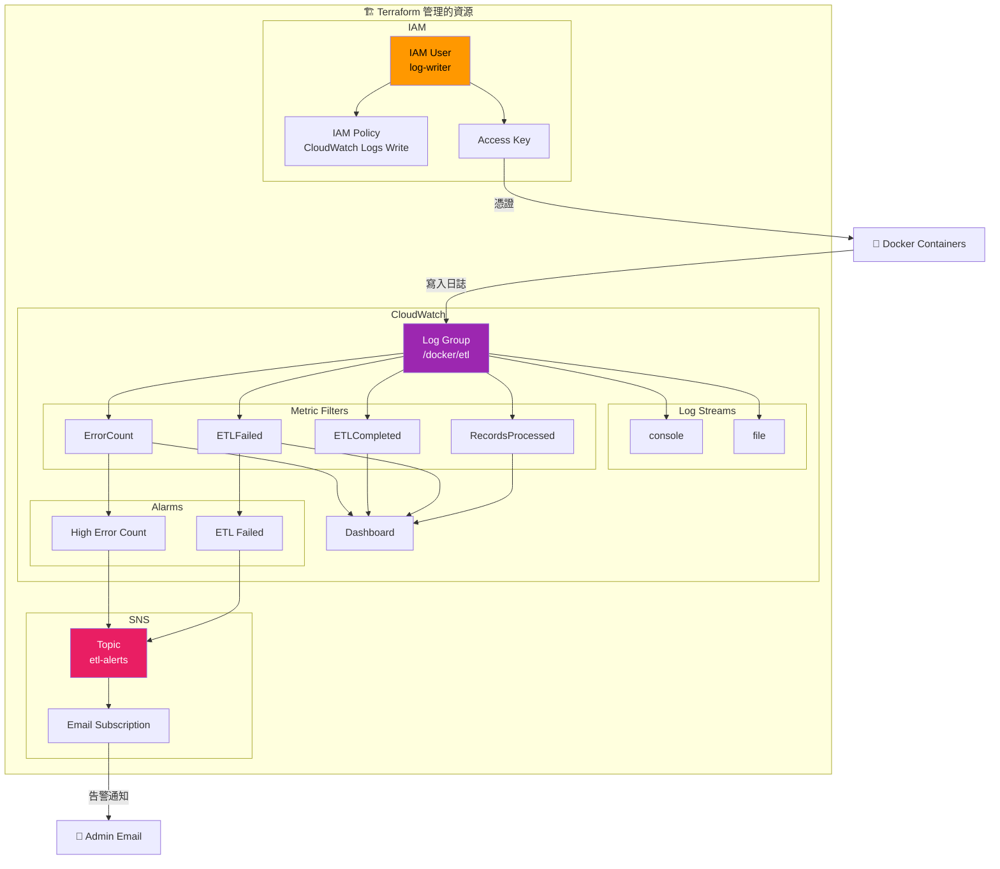
```mermaid
flowchart TB
    subgraph Terraform["🏗️ Terraform 管理的資源"]
        subgraph IAM["IAM"]
            USER[IAM User<br/>log-writer]
            POLICY[IAM Policy<br/>CloudWatch Logs Write]
            KEY[Access Key]
            
            USER --> POLICY
            USER --> KEY
        end
        
        subgraph CloudWatch["CloudWatch"]
            LG[Log Group<br/>/docker/etl]
            
            subgraph Streams["Log Streams"]
                S1[console]
                S2[file]
            end
            
            subgraph Metrics["Metric Filters"]
                MF1[ErrorCount]
                MF2[ETLCompleted]
                MF3[ETLFailed]
                MF4[RecordsProcessed]
            end
            
            subgraph Alarms["Alarms"]
                A1[High Error Count]
                A2[ETL Failed]
            end
            
            DB[Dashboard]
            
            LG --> S1
            LG --> S2
            LG --> MF1 & MF2 & MF3 & MF4
            MF1 --> A1
            MF3 --> A2
            MF1 & MF2 & MF3 & MF4 --> DB
        end
        
        subgraph SNS["SNS"]
            TOPIC[Topic<br/>etl-alerts]
            SUB[Email Subscription]
            
            TOPIC --> SUB
        end
        
        A1 & A2 --> TOPIC
    end
    
    SUB -->|"告警通知"| EMAIL[📧 Admin Email]
    KEY -->|"憑證"| DOCKER[🐳 Docker Containers]
    DOCKER -->|"寫入日誌"| LG

    style USER fill:#ff9800,color:#000
    style LG fill:#9c27b0,color:#fff
    style TOPIC fill:#e91e63,color:#fff
```

---

### 4.2 IAM 設計

#### 兩個 IAM User 的職責分離

這個專案涉及兩個不同的 IAM User，我刻意將它們分開，遵循最小權限原則：

| User | 建立方式 | 用途 | 權限範圍 |
|------|----------|------|----------|
| `terraform-deployer` | 手動建立 | 執行 Terraform 部署 | 較廣（需建立各類資源） |
| `log-writer` | Terraform 建立 | Docker 寫入 CloudWatch | 極小（僅寫入特定 Log Group） |

#### 最小權限原則實踐

`log-writer` 的 Policy 設計：

| 設計決策 | 理由 |
|----------|------|
| **限定特定 Log Group** | 僅能寫入 `/docker/etl`，即使憑證外洩也無法存取其他資源 |
| **僅授予寫入權限** | 無法讀取、刪除日誌，降低資料外洩風險 |
| **包含 Describe 權限** | CloudWatch Agent 啟動時需檢查 Log Group/Stream 是否存在 |

授予的權限清單：
- `logs:CreateLogGroup`
- `logs:CreateLogStream`
- `logs:PutLogEvents`
- `logs:DescribeLogGroups`
- `logs:DescribeLogStreams`

---

### 4.3 CloudWatch 資源規劃

| 資源類型 | 名稱 | 用途 |
|----------|------|------|
| **Log Group** | `/docker/etl` | 所有 ETL 日誌集中處 |
| **Log Stream** | `console` / `file` | 依來源分流 |
| **Metric Filter** | `ErrorCount`、`ETLCompleted`、`ETLFailed`、`RecordsProcessed` | 從 JSON log 提取指標 |
| **Alarm** | `high-error-count`、`etl-failed` | 觸發 SNS 告警 |
| **Dashboard** | `etl-dashboard` | 可視化監控面板 |

#### Metric Filter 設計

直接從 JSON 格式的 Log 中提取數值作為 Metric：

| Filter | Pattern | 提取的值 | 用途 |
|--------|---------|----------|------|
| `ErrorCount` | `{ $.level = "ERROR" }` | 固定值 1 | 統計錯誤數量 |
| `ETLCompleted` | `{ $.event = "etl_completed" }` | 固定值 1 | 統計成功次數 |
| `ETLFailed` | `{ $.event = "etl_failed" }` | 固定值 1 | 統計失敗次數 |
| `RecordsProcessed` | `{ $.event = "etl_summary" }` | `$.records_success` | 追蹤處理筆數 |

#### Alarm 規則

| 告警 | 觸發條件 | 說明 |
|------|----------|------|
| **High Error Count** | 5 分鐘內 ≥ 5 個 ERROR | 持續出現錯誤時告警 |
| **ETL Failed** | 出現 1 次 ETL 失敗事件 | 任務失敗立即告警 |

> ⚠️ **注意**：告警狀態變化時（OK → ALARM）才發送通知，持續 ALARM 不重複發送

---

### 4.4 Terraform 檔案結構

```
terraform/
├── main.tf                      # Provider 設定、後端配置
├── variables.tf                 # 輸入變數定義
├── outputs.tf                   # 輸出值（供 setup script 使用）
├── iam_user.tf                  # IAM User 與 Access Key
├── iam_policies.tf              # IAM Policy（最小權限）
├── cloudwatch_log_groups.tf     # Log Group 與 Streams
├── cloudwatch_metric_filters.tf # Metric Filters
├── cloudwatch_alarms.tf         # 告警規則
├── cloudwatch_dashboard.tf      # 可視化 Dashboard
├── sns.tf                       # SNS Topic 與 Email 訂閱
└── .env.aws                     # AWS 憑證（不納入版控）
```

---

### 4.5 執行指令與測試
---

### ETL 失敗場景測試

測試 ETL 失敗時的告警機制和錯誤記錄。

#### 方法：修改程式碼強制失敗

1. 編輯 `core/tax_registration/management/commands/load_tax_registration.py`：

```python
def handle_successful_etl_job(self):
    """執行 ETL Job, 更新成功結果, log 成功訊息"""
    # 加入這行來強制失敗
    raise Exception("測試失敗場景！")
    
    with self._track_progress():
        self._run_etl()
    self.tracker.complete()
```

2. 重新執行 ETL：

```bash

# 執行 ETL（會失敗）
./run etl --auto
```

**預期輸出：**

```
============================================================
開始執行 ETL (ID: 3)
============================================================

CommandError: 執行失敗: 測試失敗場景！
```

**驗證失敗記錄：**

```bash
./run django-shell

>>> from core.tax_registration.models import ETLJobRun
>>> job = ETLJobRun.objects.latest('started_at')
>>> job.status
'failed'
>>> job.error_message
'測試失敗場景！'
```

> ⚠️ **測試完成後，記得移除 `raise Exception` 這行！**

---
### CloudWatch 告警測試

#### 1. 測試 ETL Job Failed 告警

當 ETL 任務失敗時，應該收到 Email 告警。

1. **觸發條件**：ETL 任務執行失敗

2. **執行失敗的 ETL**：
```bash
./run etl --auto
```

3. **檢查告警狀態**：
   - 前往 AWS CloudWatch Console
   - 進入 **Alarms** → 找到 `etl-log-demo-etl-failed`
   - 狀態應該從 `OK` 變成 `In alarm`

4. **檢查 Email**：
   - 收到主旨為 `ALARM: "etl-log-demo-etl-failed" in Asia Pacific (Tokyo)` 的郵件

#### 2. 測試 High Error Count 告警

當 5 分鐘內發生 5 個以上 ERROR 時觸發告警。

1. **手動產生 ERROR Log**：

```bash
./run django-shell

>>> import logging
>>> logger = logging.getLogger('tax_registration.etl')
>>> for i in range(6):
...     logger.error(f"測試錯誤 #{i+1}")
```

2. **等待 1-2 分鐘**（CloudWatch Metric Filter 需要時間處理）

3. **檢查告警狀態**：
   - 前往 CloudWatch Console → **Alarms**
   - 找到 `etl-log-demo-high-error-count`
   - 狀態應該變成 `In alarm`

4. **檢查 Email**：
   - 收到主旨為 `ALARM: "etl-log-demo-high-error-count"` 的郵件

> 💡 **提示**：告警只在狀態**變化**時發送通知（OK → ALARM），持續處於 ALARM 狀態不會重複發送。

---

### CloudWatch Dashboard 檢視

1. 前往 AWS CloudWatch Console

2. 點擊左側選單 **Dashboards**

3. 找到 `etl-log-demo-etl-dashboard`

4. Dashboard 包含以下 Widget：

| Widget | 說明 |
|--------|------|
| ❌ ERROR 數量 | 錯誤發生趨勢圖 |
| ✅ ETL 完成次數 | 成功/失敗次數對比 |
| 📊 處理筆數 | 每次 ETL 處理的記錄數 |
| 📋 最近的 Log 事件 | 即時 Log 查詢結果 |
| 🚨 告警狀態 | 所有告警的當前狀態 |

5. **驗證 Log 是否正確收集**：
   - 在「最近的 Log 事件」Widget 中應該看到 JSON 格式的 Log
   - 包含 `timestamp`、`level`、`message` 等欄位
   - 


---

## 五、題目四：Docker Log 蒐集 - Log Implement

### 5.1 雙路徑收集架構

題目要求示範兩種 Docker log 收集方式，因此採用「雙路徑」架構，將 logs 同時透過兩種方式送到 CloudWatch：

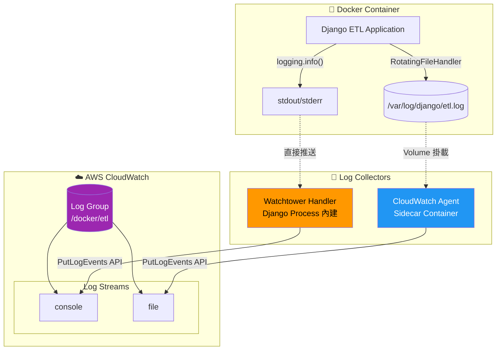
```mermaid
flowchart TB
    subgraph Docker["🐳 Docker Container"]
        APP[Django ETL Application]
        LOG_FILE[("/var/log/django/etl.log")]
        
        APP -->|"logging.info()"| CONSOLE[stdout/stderr]
        APP -->|"RotatingFileHandler"| LOG_FILE
    end

    subgraph Collectors["📡 Log Collectors"]
        WT[Watchtower Handler<br/>Django Process 內建]
        CWA[CloudWatch Agent<br/>Sidecar Container]
    end

    subgraph AWS["☁️ AWS CloudWatch"]
        LG[("Log Group<br/>/docker/etl")]
        
        subgraph Streams["Log Streams"]
            S1[console]
            S2[file]
        end
        
        LG --> S1
        LG --> S2
    end

    CONSOLE -.->|"直接推送"| WT
    WT -->|"PutLogEvents API"| S1
    
    LOG_FILE -.->|"Volume 掛載"| CWA
    CWA -->|"PutLogEvents API"| S2

    style WT fill:#ff9800,color:#000
    style CWA fill:#2196f3,color:#fff
    style LG fill:#9c27b0,color:#fff
```

---

### 5.2 為什麼需要兩種收集方式？

| 路徑 | 來源 | 工具 | 適用場景 |
|------|------|------|----------|
| **Console** | stdout/stderr | Watchtower | 即時日誌、應用程式直接輸出 |
| **File** | 實體檔案 | CloudWatch Agent | 需要持久化、支援輪替的日誌 |

---

### 5.3 技術選型比較

在設計 Log 收集方案時，我評估了幾個常見選項：

| 方案 | 收集來源 | 部署方式 | 優點 | 缺點 |
|------|----------|----------|------|------|
| **Docker awslogs driver** | stdout/stderr | Docker daemon 設定 | 零程式碼、原生支援 | 憑證需在 host 層級、無法收集檔案 |
| **CloudWatch Agent** | 檔案 | Sidecar container | 支援檔案輪替、可收集 metrics | 需額外 container、有 flush 延遲 |
| **Watchtower** | Python logging | Application 內建 | 即時推送、可加 extra fields | 僅限 Python、與應用耦合 |
| **Fluent Bit** | stdout + 檔案 | Sidecar container | 輕量、多 output 支援 | 需學習設定語法、非 AWS 原生 |
| **AWS FireLens** | stdout/stderr | ECS 原生整合 | ECS 深度整合 | 僅限 ECS 環境 |

#### 本專案選擇：Watchtower + CloudWatch Agent

| 選擇理由 | 說明 |
|----------|------|
| **滿足題目要求** | 同時示範 console 與 file 兩種收集方式 |
| **AWS 原生整合** | 無需額外學習 Fluent Bit 設定語法 |
| **Django 友善** | Watchtower 可直接作為 logging handler，支援 `extra` 欄位 |
| **本地開發友善** | 不依賴 ECS，Docker Compose 即可運行 |

---

### 5.4 Logging 格式設計

#### 為什麼選用 JSON 格式？

| 理由 | 說明 |
|------|------|
| **結構化查詢** | CloudWatch Logs Insights 可直接查詢 JSON 欄位 |
| **Metric Filter** | 可從 JSON 欄位提取數值建立指標（如 `records_success`） |
| **欄位擴展** | 可自由添加 `extra` 欄位提供上下文 |

#### Logging 欄位設計

| 欄位 | 說明 | 用途 |
|------|------|------|
| `timestamp` | ISO 8601 格式時間戳 | 跨 Stream 排序、時間範圍查詢 |
| `level` | INFO / WARNING / ERROR | Metric Filter 統計錯誤數 |
| `name` | Logger 名稱 | 區分不同模組的日誌 |
| `message` | 日誌訊息 | 人眼閱讀 |
| `event` | 事件類型 | Metric Filter 提取特定事件 |
| `job_run_id` | ETL 任務 ID | 關聯查詢同一次執行的所有日誌 |
| `batch_num` | 批次編號 | 定位問題發生在哪一批 |

#### 日誌範例

```json
{
  "timestamp": "2026-01-28T10:30:00+0800",
  "level": "INFO",
  "name": "tax_registration.etl",
  "message": "批次處理完成",
  "event": "batch_completed",
  "job_run_id": 42,
  "batch_num": 5,
  "records_success": 49850,
  "records_failed": 150
}
```

---

### 5.5 Django Logging 設定

#### Handler 配置

| Handler | 類型 | 輸出目標 | 格式 |
|---------|------|----------|------|
| `console` | StreamHandler | stdout | Pretty（彩色，開發用） |
| `file` | RotatingFileHandler | `/var/log/django/etl.log` | JSON |
| `watchtower` | CloudWatchLogHandler | CloudWatch `console` stream | JSON |

#### 檔案輪替設定

| 設定 | 值 | 說明 |
|------|-----|------|
| `maxBytes` | 10 MB | 單檔達 10MB 時存入 backup |
| `backupCount` | 5 | 最多保留 5 個備份檔 |

---

### 5.6 CloudWatch Agent 設定

Agent 透過 `config.json` 設定收集規則：

| 設定項 | 值 | 說明 |
|--------|-----|------|
| `file_path` | `/var/log/django/etl.log` | 監控的檔案路徑 |
| `log_group_name` | `/docker/etl` | 目標 Log Group |
| `log_stream_name` | `file` | 目標 Stream |
| `timestamp_format` | `%Y-%m-%dT%H:%M:%S%z` | 解析 JSON 中的時間戳 |
| `multi_line_start_pattern` | `{` | JSON 日誌以 `{` 開頭 |
| `force_flush_interval` | 5 | 每 5 秒送到 CloudWatch |

---

---

### 5.7 執行指令與測試

#### 驗證日誌收集

```bash
# 1. 產生測試日誌
./run django-shell

>>> import logging
>>> logger = logging.getLogger('tax_registration.etl')
>>> logger.info("測試 console 路徑", extra={"event": "test", "batch_num": 1})
```

#### 在 CloudWatch Console 驗證

1. 登入 AWS Console → CloudWatch → Log groups
2. 選擇 `/docker/etl`
3. 檢查 `console` stream：應看到 Watchtower 推送的日誌
4. 檢查 `file` stream：應看到 CloudWatch Agent 收集的日誌（可能有數秒延遲）

---

## 附錄：完整測試 Checklist

| # | 章節 | 測試項目 | 指令 | 預期結果 | 通過 |
|---|------|----------|------|----------|------|
| 1 | 題目一 | Dry Run | `./run dry-run` | 顯示 DRY RUN，不寫入資料 | ⬜ |
| 2 | 題目一 | 限制筆數測試 | `./run etl --limit 10000` | 僅處理前 10,000 筆 | ⬜ |
| 3 | 題目一 | 完整匯入 | `./run etl` | 約 15 分鐘完成，成功匯入約 170 萬筆 | ⬜ |
| 4 | 題目一 | 斷點續傳 | `./run resume` | 從上次批次繼續 | ⬜ |
| 5 | 題目二 | 服務啟動 | `./run up` | 4 個服務皆啟動成功 | ⬜ |
| 6 | 題目二 | 服務健康檢查 | `./run ps` | 所有 container 狀態為 healthy | ⬜ |
| 7 | 題目二 | 每日排程設定 | `./run etl-per-day` | 排程建立成功 | ⬜ |
| 8 | 題目二 | 測試排程設定 | `./run dry-run-per-min` | 每分鐘執行一次 dry-run | ⬜ |
| 9 | 題目二 | Django Admin | http://localhost:8000/admin/ | 可登入並查看排程 | ⬜ |
| 10 | 題目三 | Terraform 部署 | `./run setup` | AWS 資源建立成功 | ⬜ |
| 11 | 題目三 | High Error 告警 | 產生 6 個 ERROR | 收到 Email 告警 | ⬜ |
| 12 | 題目三 | Dashboard | AWS Console | 看到 5 個監控 Widget | ⬜ |
| 13 | 題目四 | Console 日誌 | CloudWatch Console | `console` stream 有日誌 | ⬜ |
| 14 | 題目四 | File 日誌 | CloudWatch Console | `file` stream 有日誌 | ⬜ |
| 15 | 清理 | 資源銷毀 | `./run cleanup` | Docker 停止、AWS 資源刪除 | ⬜ |

---

## 資源清理

當測試完成後，請依照以下步驟清理資源，避免產生不必要的 AWS 費用。

### 清理順序

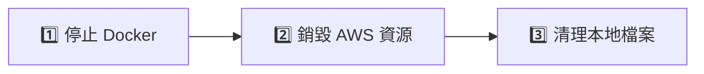
```mermaid
flowchart LR
    A["1️⃣ 停止 Docker"] --> B["2️⃣ 銷毀 AWS 資源"]
    B --> C["3️⃣ 清理本地檔案"]
    
```

### Step 1：停止 Docker Compose

```bash
./run down
```

如需完全清除 Volume（包含資料庫資料）：

```bash
docker compose down -v
```

### Step 2：銷毀 AWS 資源

```bash
./run tf-destroy
```

輸入 `yes` 確認後，Terraform 會銷毀所有資源。

### Step 3：清理本地檔案（選用）

```bash
# 清除自動產生的憑證檔案
rm -f docker/cloudwatch-agent/.aws/credentials
rm -f .env.local
```

### 一鍵清理

```bash
./run cleanup
```

此指令會依序執行 `docker compose down` 和 `terraform destroy`。

---
